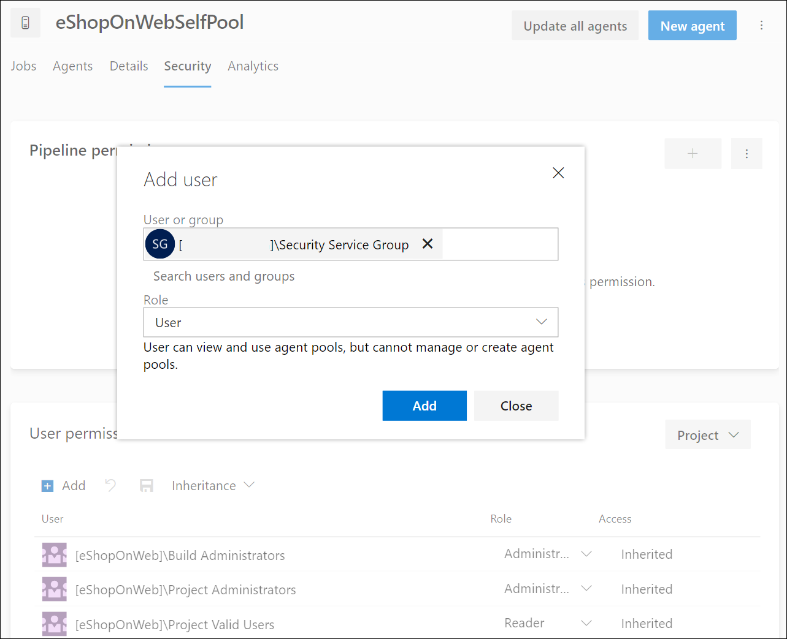

---
lab:
    title: 'Learning Lab: Configure agents and agent pools for secure pipelines'
    module: 'Module 1: Configure secure access to pipeline resources'
---

# Learning Lab: Configure agents and agent pools for secure pipelines

In this lab, you will learn how to configure Azure DevOps agents and agent Pools and manage permissions for those pools. Azure DevOps Agent Pools provide the resources to run your build and release pipelines.

This exercise takes approximately **20** minutes.

## Before you start

You'll need an Azure subscription, Azure DevOps organization, and the eShopOnWeb application to follow the labs.

- Follow the steps to [validate your lab environment](APL2001_M00_Validate_Lab_Environment.md).
- PAT token for the agent configuration.

## Instructions

You'll create agents and configure self-hosted agents using Windows. If you want to configure agents on Linux or MacOS, follow the instructions in the [Azure DevOps documentation](https://docs.microsoft.com/azure/devops/pipelines/agents/v2-linux).

### Exercise 1: Create agents and configure agent pools

1. Navigate to the Azure DevOps portal at https://dev.azure.com and sign in with your account.
2. Choose the organization you want to work with.
3. Open the eShopOnWeb project, and click on "Project settings" from the left-side bottom menu.
4. From Pipelines > Agent Pools, click on the "Add pool" button.
5. Choose the "Self-hosted" pool type.
6. Provide a name for the agent pool, such as "eShopOnWebSelfPool," and add an optional description.
7. Leave the "Grant access permission to all pipelines" option unchecked.

    

8. Click on "Create" button to create the agent pool.
9. Click on the newly created agent pool, and then click on the "Agents" tab.
10. Click on the "New agent" button and then "Download" button from the "Download agent" in the new pop-up window.
11. Follow the installation instructions to install the agent on your machine from the pop-up window.
    1. Run the following commands from Powershell to create a new agent folder in your machine.

        ```powershell
        mkdir agent ; cd agent        
        ```

        > [!NOTE]
        > Make sure you are in the root folder of your user profile or the folder where you want to install the agent.

    2. If you choose the "Download" folder in your machine, from Powershell, run the suggested command:

        ```powershell
        Add-Type -AssemblyName System.IO.Compression.FileSystem ; [System.IO.Compression.ZipFile]::ExtractToDirectory("$HOME\Downloads\vsts-agent-win-x64-3.220.2.zip", "$PWD")
        
        ```

        > [!NOTE]
        > If you downloaded the agent to a different location, replace the path in the above command.

12. Before configuring your agent, create a new PAT token or choose an existing one. To create a new PAT token, follow the steps below:
    1. Navigate to the eShopOnWeb project, and click on "User settings" from the right-side top menu (left of your user profile picture).
    2. Click on the "Personal Access Tokens" menu.

        

    3. Click on the "New Token" button.
    4. Provide a name for the token, such as "eShopOnWebToken".
    5. Select the Azure DevOps organization you want to use the token.
    6. Set the expiration date for the token (only used to configure the agent).
    7. Select the custom defined scope.
    8. Click to show all scopes.
    9. Select the "Agent Pools (Read & Manage)" scope.
    10. Click on the "Create" button to create the token.
    11. Copy the token value and save it in a safe place (you will not be able to see it again. You can only regenerate the token).

        

13. To configure your agent, run the following command:

    ```powershell
    .\config.cmd
    ```

    > [!NOTE]
    > Optionally run the agent interactively by running .\run.cmd. You cannot close the command prompt window while running interactively.

14. Enter the following information when prompted to configure the agent:
    1. Enter the URL of the Azure DevOps organization: https://dev.azure.com/{your organization name}.
    2. Choose the authentication type: PAT.
    3. Enter the PAT token value you created in the previous step.
    4. Enter the agent pool name "eShopOnWebSelfPool" you created in the previous step.
    5. Enter the agent name "eShopOnWebSelfAgent".
    6. Choose the agent work folder (default is _work).
    7. Choose the agent run mode (Y to run as service).
    8. Enter Y to enable SERVICE_SID_TYPE_UNRESTRICTED for the agent service (Windows only).
    9. Enter the user account to use for the service.
    10. Enter whether to prevent service starting immediately after configuration is finished (N to start the service).

        

    11. Check the agent status by navigating to the agent pool and clicking on the "Agents" tab. You should see the new agent in the list.

        

For more details on Windows agents, see: [Self-hosted Windows agents](https://learn.microsoft.com/azure/devops/pipelines/agents/windows-agent)

### Exercise 2: Manage agent pool permissions

In this exercise, you will manage permissions for the agent pool.

1. Open the eShopOnWeb project, and click on "Project settings" from the left-side bottom menu.
2. Select Pipelines, and then select Agent pools.
3. Click on the "eShopOnWebSelfPool" agent pool created in Exercise 1.
4. In the agent pool details view, click on the Security tab.
5. You can choose to add users or group permissions to the specific project or the entire Azure DevOps organization.
6. Click the Add button to add a new user or group to the agent pool's permissions.
7. Select the desired user or group from the list.
8. Choose the appropriate role for the user or group, such as Agent Pool Reader, User or Administrator.
9. The changes are saved automatically.

    

> [!NOTE]
> If you have YAML pipelines created in the project, you can allow specific pipeline permissions for the agent pool.

## Review

In this lab, you learned how to configure Azure DevOps self-hosted agent and agent pools and manage permissions for those pools. By managing permissions effectively, you can ensure that the right users have access to the resources they need while maintaining the security and integrity of your DevOps processes.
