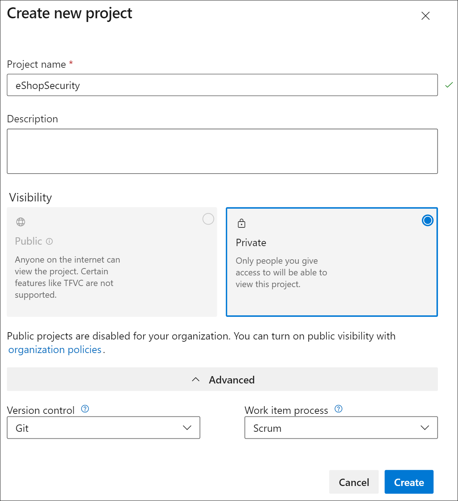
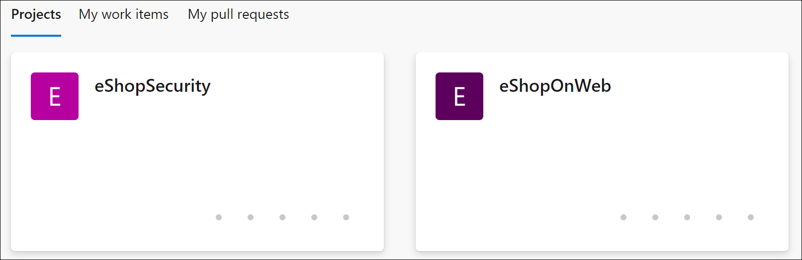
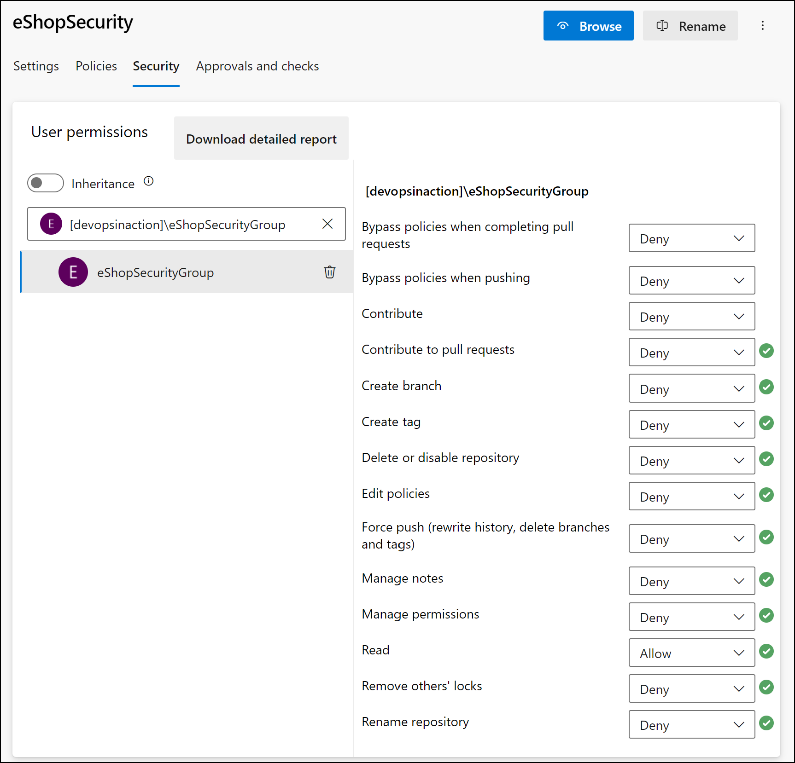
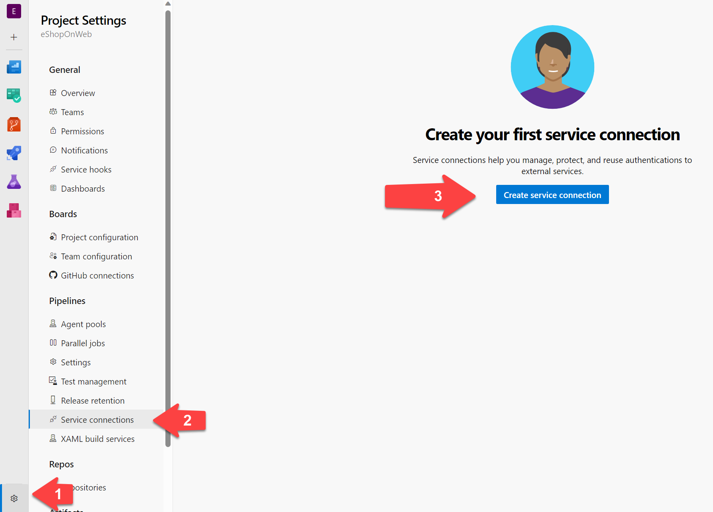
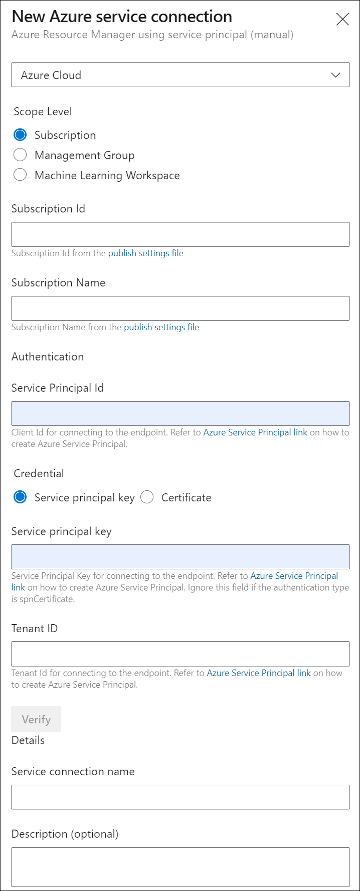
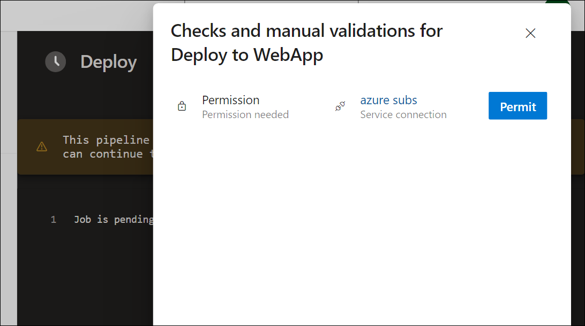
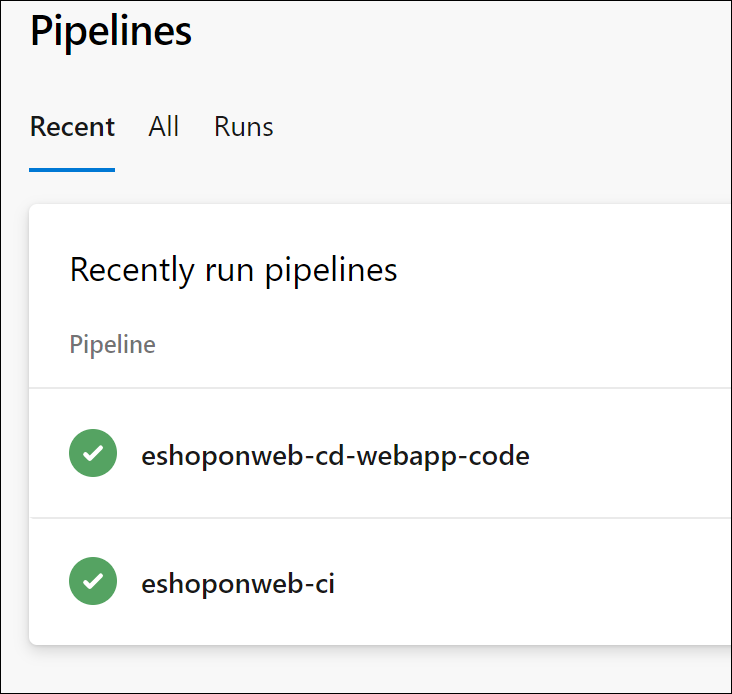
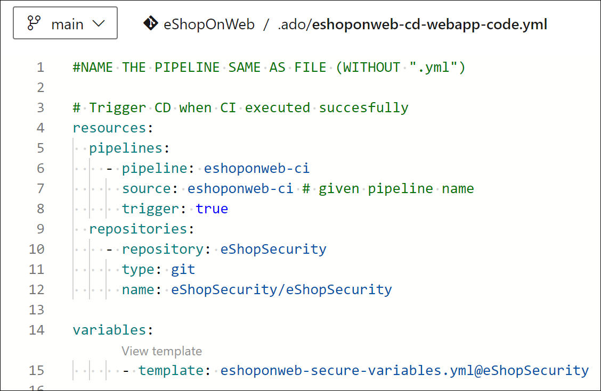
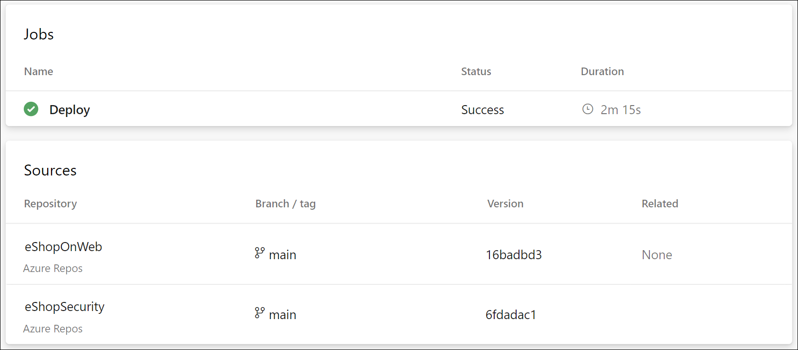
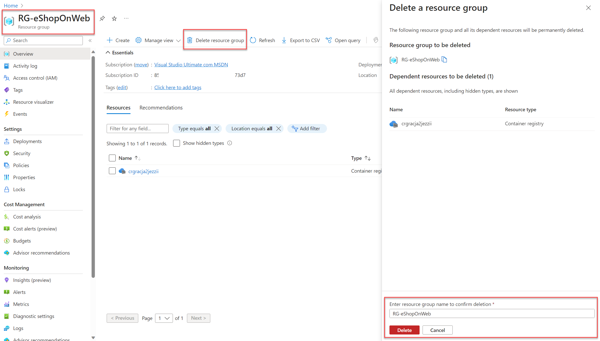

---
lab:
    title: 'Configure a project and repository structure to support secure pipelines'
    module: 'Module 1: Configure a project and repository structure to support secure pipelines'
---

# Configure a project and repository structure to support secure pipelines

In this lab, you will learn how to configure a project and repository structure in Azure DevOps to support secure pipelines. This lab covers best practices for organizing projects and repositories, assigning permissions, and managing secure files.

These exercises take approximately **30** minutes.

## Before you start

You'll need an Azure subscription, Azure DevOps organization, and the eShopOnWeb application to follow the labs.

- Follow the steps to [validate your lab environment](APL2001_M00_Validate_Lab_Environment.md).

## Instructions

### Exercise 1: Configure a secure project structure

In this exercise, you will configure a secure project structure by creating a new project and assigning it project permissions. Separating responsibilities and resources into different projects or repositories with specific permissions supports security.

#### Task 1: Create a new team project

1. Navigate to the Azure DevOps portal at `https://dev.azure.com` and open your organization.

1. Open your **organization settings** at the bottom left corner of the portal and then **Projects** under the General section.

1. Select the **New Project** option and use the following settings:
   - name: **eShopSecurity**
   - visibility: **Private**
   - Advanced: Version Control: **Git**
   - Advanced: Work Item Process: **Scrum**

    

1. Select **Create** to create the new project.

1. You can now switch between the different projects by clicking on the Azure DevOps icon in the upper left corner of the Azure DevOps portal.

    

You can manage permissions and settings for each project separately by going to the Project settings menu and selecting the appropriate team project. If you have multiple users or teams working on different projects, you can also assign permissions to each project separately.

#### Task 2: Create a new repository and assign project permissions

1. Select the organization name in the upper left corner of the Azure DevOps portal and select the new **eShopSecurity** project.

1. Select the **Repos** menu.

1. Select the **Initialize** button to initialize the new repository by adding the README.md file.

1. Open the **Project settings** menu in the lower left corner of the portal and select **Repositories** under the Repos section.

1. Select the new **eShopSecurity** repository and select the **Security** tab.

1. Remove the Inherit permissions from parent by unchecking the **Inheritance** toggle button.

1. Select the **Contributors** group and select the **Deny** dropdown for all permissions except **Read**. This will prevent all users from the Contributors group from accessing the repository.

1. Select your user under Users and select the **Allow** button to allow all permissions.

    

1. (Optional) Add specific group of users, or user that you want to grant access to the repository and run pipelines from the eShopOnWeb project. Click on the search box, enter the name of the group, select it, and then set the permissions you want to allow or deny for the group or user.

    > [!NOTE]
    > Ensure that you have the same group in your eShopOnWeb project. This will allow you to run pipelines from the eShopOnWeb project and access the repository in the eShopSecurity project.

1. Your changes will be saved automatically.

Now only the user you assigned permissions and the administrators can access the repository. This is useful when you want to allow specific users to access the repository and run pipelines from the eShopOnWeb project.

### Exercise 2: Configure a pipeline and template structure to support secure pipelines

#### Task 1: (If done, skip) Import and run the CI pipeline

1. Navigate to the Azure DevOps portal at `https://dev.azure.com` and open your organization.

1. Open the **eShopOnWeb** project in Azure DevOps.

1. Go to **Pipelines > Pipelines**.

1. Select the **Create Pipeline** button.

1. Select **Azure Repos Git (Yaml)**.

1. Select the **eShopOnWeb** repository.

1. Select **Existing Azure Pipelines YAML File**.

1. Select the **/.ado/eshoponweb-ci.yml** file then select **Continue**.

1. Select the **Run** button to run the pipeline.

1. Your pipeline will take a name based on the project name. Rename it for identifying the pipeline better.

1. Go to **Pipelines > Pipelines** and select the recently created pipeline. Select the ellipsis and then select **Rename/move** option.

1. Name it **eshoponweb-ci** and select **Save**.

#### Task 2: Create a Service Principal and Service Connection to access Azure resources

In this task, you will create a Service Principal by using the Azure CLI, and Service Connection in Azure DevOps which will allow you to deploy resources on your Azure subscription.

1. Start a web browser, navigate to the Azure Portal at `https://portal.azure.com`, and sign in with the user account that has the Owner role in the Azure subscription you will be using in this lab and has the role of the Global Administrator in the Azure AD tenant associated with this subscription.

1. On the Azure portal, select the **Cloud Shell** icon, located directly to the right of the search textbox at the top of the page.

1. If prompted to select either **Bash** or **PowerShell**, select **Bash**.

   > [!NOTE]
   > If this is the first time you are starting **Cloud Shell** and you are presented with the **You have no storage mounted** message, select the subscription you are using in this lab, and select **Create storage**.

1. From the **Bash** prompt, in the **Cloud Shell** pane, run the following commands to retrieve the values of the Azure subscription ID and subscription name attributes:

    ```bash
    az account show --query id --output tsv
    az account show --query name --output tsv
    ```

    > [!NOTE]
    > Copy both values to a text file. You will need them later in this lab.

1. From the **Bash** prompt in the **Cloud Shell** pane, run the following command to create a Service Principal:

    ```bash
    az ad sp create-for-rbac --name myServicePrincipalName \
                         --role contributor \
                         --scopes /subscriptions/mySubscriptionID
    ```

    > [!NOTE]
    > Replace the **myServicePrincipalName** with any unique string of characters consisting of letters and digits, for example **AzureDevOpsSP**, and **mySubscriptionID** with your Azure subscriptionId.

    > [!NOTE]
    > The command will generate a JSON output. Copy the output to text file. You will need it later in this lab.

1. Next, navigate to the Azure DevOps portal at `https://dev.azure.com` and open your organization.

1. Open the **eShopOnWeb** project, and select **Project settings** in the bottom left corner of the portal.

1. Select the **Service connections** under Pipelines, and then select **Create service connection** button.

    

1. On the **New service connection** blade, select **Azure Resource Manager** and **Next** (may need to scroll down).

1. Then choose **Service Principal (manual)** and select **Next**.

1. Fill in the empty fields using the information gathered during previous steps:
    - Subscription Id and Name.
    - Service Principal Id (or clientId/AppId), Service Principal Key (or Password) and TenantId.
    - In **Service connection name** type **azure subs**. This name will be referenced in YAML pipelines when needing an Azure DevOps Service Connection to communicate with your Azure subscription.

        

1. Do not check **Grant access permission to all pipelines**. Select **Verify and Save**.

    > [!NOTE]
    > The **Grant access permission to all pipelines** option is not recommended for production environments. It is only used in this lab to simplify the configuration of the pipeline.

#### Task 3: (If done, skip) Import and run the CD pipeline

1. Go to **Pipelines > Pipelines**.

1. Select **New pipeline** button.

1. Select **Azure Repos Git (Yaml)**.

1. Select the **eShopOnWeb** repository.

1. Select **Existing Azure Pipelines YAML File**.

1. Select the **/.ado/eshoponweb-cd-webapp-code.yml** file then select **Continue**.

1. In the YAML pipeline definition under the variables section, customize:
   - **AZ400-EWebShop-NAME** with the name of your preference, for example, **rg-eshoponweb-secure**.
   - **Location** with the name of the Azure region you want to deploy your resources, for example, **southcentralus**.
   - **YOUR-SUBSCRIPTION-ID** with your Azure subscription id.
   - **az400eshop-NAME**, with a web app name to be deployed with a global unique name, for example, **eshoponweb-lab-secure**.

1. Select **Save and Run**, choose to commit directly to the main branch, or create a new branch.

1. Select **Save and Run** again.

    > [!NOTE]
    > If you choose to create a new branch, you will need to create a pull request to merge the changes to the main branch.

1. Open the pipeline. If you see the message "This pipeline needs permission to access a resource before this run can continue to Deploy to WebApp", select **View**, **Permit** and **Permit** again. This is needed to allow the pipeline to create the Azure App Service resource.

    

1. The deployment may take a few minutes to complete, wait for the pipeline to execute. The CD definition consists of the following tasks:
      - **Resources**: it is prepared to automatically trigger based on CI pipeline completion. It also downloads the repository for the bicep file.
      - **AzureResourceManagerTemplateDeployment**: Deploys the Azure Web App using bicep template.
1. Your pipeline will take a name based on the project name. Let's rename it for identifying the pipeline better.

1. Go to **Pipelines > Pipelines** and select the recently created pipeline. Select the ellipsis and then select **Rename/move** option.

1. Name it **eshoponweb-cd-webapp-code** and select **Save**.

Now you should have two pipelines running in your eShopOnWeb project.



#### Task 4: Move the CD pipeline variables to a YAML template

In this task, you will create a YAML template to store the variables used in the CD pipeline. This will allow you to reuse the template in other pipelines.

1. Go to **Repos** and then **Files**.

1. Expand the **.ado** folder and select  **New file**.

1. Name the file **eshoponweb-secure-variables.yml** and select **Create**.

1. Add the variables section used in the CD pipeline to the new file. The file should look like the following:

    ```YAML
    variables:
      resource-group: 'rg-eshoponweb-secure'
      location: 'southcentralus' #name of the Azure region you want to deploy your resources
      templateFile: '.azure/bicep/webapp.bicep'
      subscriptionid: 'YOUR-SUBSCRIPTION-ID'
      azureserviceconnection: 'YOUR-AZURE-SERVICE-CONNECTION-NAME'
      webappname: 'eshoponweb-lab-secure'

    ```

    > [!IMPORTANT]
    > Replace the values of the variables with the values of your environment (resource group, location, subscription ID, Azure service connection, and web app name).

1. Select **Commit**, add a comment, and then select **Commit** button.

1. Open the **eshoponweb-cd-webapp-code.yml** pipeline definition, and replace the variables section with the following:

    ```YAML
    variables:
      - template: eshoponweb-secure-variables.yml
    ```

    > [!NOTE]
    > If you are using a different path for the template file, you will need to update the path in the pipeline definition.

1. Select **Save** and **Run** the pipeline again.

Now you have a YAML template with the variables used in the CD pipeline. You can reuse this template in other pipelines in scenarios where you need to deploy the same resources. Also, your operations team can controls the resource group and location where the resources are deployed and other information in your template values and you don't need to make any changes to your pipeline definition.

#### Task 5: Move the YAML templates to a separate repository and project

In this task, you will move the YAML templates to a separate repository and project.

1. In your eShopSecurity project, go to **Repos > Files**.

1. Create a new file named **eshoponweb-secure-variables.yml**.

1. Copy the content of the file **.ado/eshoponweb-secure-variables.yml** from the eShopOnWeb repository to the new file.

1. Commit the changes.

1. Open the **eshoponweb-cd-webapp-code.yml** pipeline definition from the eShopOnWeb project.

1. Add the following to the resources section:

    ```YAML
    resources:
      repositories:
        - repository: eShopSecurity
          type: git
          name: eShopSecurity/eShopSecurity #name of the project and repository

    ```

1. Replace the variables section with the following:

    ```YAML
    variables:
      - template: eshoponweb-secure-variables.yml@eShopSecurity #name of the template and repository
    ```

    

1. Select **Save** and **Run** the pipeline again. You will see that the pipeline is using the YAML template from the eShopSecurity repository.

    

Now you have the YAML templates in a separate repository and project. You can reuse these templates in other pipelines in scenarios where you need to deploy the same resources. Also, your operations team can controls the resource group, location, security and where the resources are deployed and other information in your template values and you don't need to make any changes to your pipeline definition.

### Exercise 2: Perform cleanup of Azure and Azure DevOps resources

In this exercise, you will remove Azure and Azure DevOps resources created in this lab.

#### Task 1: Remove Azure resources

1. In the Azure portal, open the created Resource Group and select **Delete resource group** for all created resources in this lab.

    

    > [!WARNING]
    > Always remember to remove any created Azure resources that you no longer use. Removing unused resources ensures you will not see unexpected charges.

#### Task 2: Remove Azure DevOps pipelines

1. Navigate to the Azure DevOps portal at `https://dev.azure.com` and open your organization.

1. Open the **eShopOnWeb** project.

1. Go to **Pipelines > Pipelines**.

1. Go to **Pipelines > Pipelines** and remove the existing pipelines.

## Review

In this lab, you learned how to configure and organize a secure project and repository structure in Azure DevOps. By managing permissions effectively, you can ensure that the right users have access to the resources they need while maintaining the security and integrity of your DevOps pipelines and processes.
