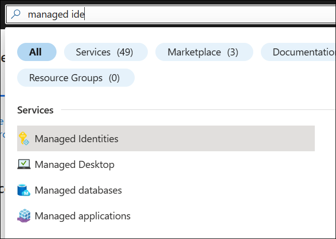
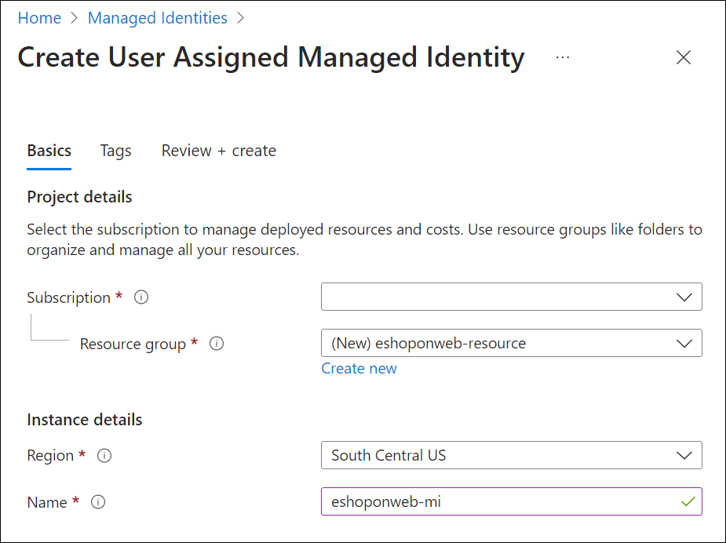

---
lab:
    title: 'Managed identity for projects and pipelines'
    module: 'Module 2: Manage identity for projects, pipelines, and agents'
---

# Managed identity for projects and pipelines

Managed identities offer a secure method for controlling access to Azure resources. Azure handles these identities automatically, allowing you to verify access to services compatible with Azure AD authentication. This means you won't need to embed credentials into your code, enhancing security. In Azure DevOps, managed identities can authenticate Azure resources within your self-hosted agents, simplifying access control without compromising security.

In this lab, you'll create a managed identity to use in your YAML pipelines using Azure DevOps with self-hosted agents and a managed identity.

These exercises take approximately **45** minutes.

## Before you start

You'll need an Azure subscription, Azure DevOps organization, and the eShopOnWeb application to follow the labs.

- Follow the steps to [validate your lab environment](APL2001_M00_Validate_Lab_Environment.md).

- Verify that you have a Microsoft account or an Azure AD account with the Contributor or the Owner role in the Azure subscription. For details, refer to [List Azure role assignments using the Azure portal](https://learn.microsoft.com/azure/role-based-access-control/role-assignments-list-portal) and [View and assign administrator roles in Azure Active Directory](https://learn.microsoft.com/azure/active-directory/roles/manage-roles-portal).

## Instructions

### Exercise 1: Import and run CI/CD Pipelines

In this exercise, you will import and run the CI pipeline, configure the service connection with your Azure Subscription and then import and run the CD pipeline.

#### Task 1: (If done, skip) Import and run the CI pipeline

Let's start by importing the CI pipeline named [eshoponweb-ci.yml](https://github.com/MicrosoftLearning/eShopOnWeb/blob/main/.ado/eshoponweb-ci.yml).

1. Navigate to the Azure DevOps portal at `https://dev.azure.com` and open your organization.

1. Open the **eShopOnWeb** project.

1. Go to **Pipelines > Pipelines**.

1. Select **New Pipeline** button.

1. Select **Azure Repos Git (Yaml)**.

1. Select the **eShopOnWeb** repository.

1. Select **Existing Azure Pipelines YAML File**.

1. Select the **/.ado/eshoponweb-ci.yml** file then click on **Continue**.

1. Select the **Run** button to run the pipeline.

    > [!NOTE]
    > Your pipeline will take a name based on the project name. Rename it for identifying the pipeline better.

1. Go to **Pipelines > Pipelines**, select the recently created pipeline, select the ellipsis and then select **Rename/move** option.

1. Name it **eshoponweb-ci** and select **Save**.

#### Task 2: Manage the service connection

You can create a connection from Azure Pipelines to external and remote services for executing tasks in a job.

In this task, you will create a service principal by using the Azure CLI, which will allow Azure DevOps to:

- Deploy resources on your azure subscription
- Deploy the eShopOnWeb application

> [!NOTE]
> If you do already have a service principal and a service connection to your Azure subscription named **azure subs**, you can proceed directly to the next task.

You will need a service principal to deploy Azure resources from Azure Pipelines.

A service principal is automatically created by Azure Pipeline when you connect to an Azure subscription from inside a pipeline definition or when you create a new service connection from the project settings page (automatic option). You can also manually create the service principal from the portal or using Azure CLI and re-use it across projects.

1. Start a web browser, navigate to the Azure Portal at `https://portal.azure.com`, and sign in with the user account that has the Owner role in the Azure subscription you will be using in this lab and has the role of the Global Administrator in the Azure AD tenant associated with this subscription.

1. In the Azure portal, select the **Cloud Shell** icon, located directly to the right of the search text box at the top of the page.

1. If prompted to select either **Bash** or **PowerShell**, select **Bash**.

   > [!NOTE]
   > If this is the first time you are starting **Cloud Shell** and you are presented with the **You have no storage mounted** message, select the subscription you are using in this lab, and select **Create storage**.

1. From the **Bash** prompt, in the **Cloud Shell** pane, run the following commands to retrieve the values of the Azure subscription ID attribute:

    ```sh
    subscriptionName=$(az account show --query name --output tsv)
    subscriptionId=$(az account show --query id --output tsv)
    echo $subscriptionName
    echo $subscriptionId
    ```

    > [!NOTE]
    > Copy both values to a text file. You will need them later in this lab.

1. From the **Bash** prompt, in the **Cloud Shell** pane, run the following command to create a service principal:

    ```sh
    az ad sp create-for-rbac --name sp-eshoponweb-azdo --role contributor --scopes /subscriptions/$subscriptionId
    ```

    > [!NOTE]
    > The command will generate a JSON output. Copy the output to text file. You will need it later in this lab.

1. Next, navigate to the Azure DevOps **eShopOnWeb** project. Click on **Project Settings > Service Connections (under Pipelines)** and **New Service Connection**.

1. On the **New service connection** blade, select **Azure Resource Manager** and **Next** (may need to scroll down).

1. Then choose **Service principal (manual)** and select **Next**.

1. Fill in the empty fields using the information gathered during previous steps:
    - Subscription Id and Name.
    - Service Principal Id (or clientId), Key (or Password) and TenantId.
    - In **Service connection name** type **azure subs**. This name will be referenced in YAML pipelines when needing an Azure DevOps Service Connection to communicate with your Azure subscription.

1. Select **Verify and Save**.

#### Task 3: Import and run the CD pipeline

Now, import the CD pipeline named [eshoponweb-cd-webapp-code.yml](https://github.com/MicrosoftLearning/eShopOnWeb/blob/main/.ado/eshoponweb-cd-webapp-code.yml).

1. Go to **Pipelines > Pipelines**.

1. Click on **New pipeline** button.

1. Select **Azure Repos Git (Yaml)**.

1. Select the **eShopOnWeb** repository.

1. Select **Existing Azure Pipelines YAML File**.

1. Select the **/.ado/eshoponweb-cd-webapp-code.yml** file then select **Continue**.

1. In the YAML pipeline definition, set the variables section to:

    ```YAML
    variables:
      resource-group: 'AZ400-EWebShop-NAME'
      location: 'westeurope'
      templateFile: '.azure/bicep/webapp.bicep'
      subscriptionid: 'YOUR-SUBSCRIPTION-ID'
      azureserviceconnection: 'azure subs'
      webappname: 'az400-webapp-NAME'
    ```

1. In the variables section, replace the placeholders with the following values:

   - **AZ400-EWebShop-NAME** with the name of your preference, for example, **rg-eshoponweb**.
   - **location** with the name of the Azure region you want to deploy your resources, for example, **southcentralus**.
   - **YOUR-SUBSCRIPTION-ID** with your Azure subscription id.
   - **az400-webapp-NAME**, with a web app name to be deployed with a global unique name, for example, **eshoponweb-lab-YOURNAME**.

1. If present, in the resources section, remove the following entries:

    ```YAML
    repositories:
      - repository: eShopSecurity
        type: git
        name: eShopSecurity/eShopSecurity #name of the project and repository
    ```

1. (Optional) You can use a self-hosted agent updating the pool name currently set to the Microsoft-hosted agent to the name of the agent pool you created, **eShopOnWebSelfPool**.

    Instead of:

    ```YAML
        pool:
          vmImage: windows-latest
    
    ```

    Use:

    ```YAML
        pool: eShopOnWebSelfPool
    
    ```

    > [!NOTE]
    > To run the pipeline with the self-hosted agent, you will need to have the agent running and all the prerequisites installed, for example, Visual Studio to build the solution. If you do not have the prerequisites installed, you can use the Microsoft-hosted agent.

1. Select **Save and Run**, choose to commit directly to the main branch, or create a new branch.

1. Select **Save and Run** again.

    > [!NOTE]
    > If you choose to create a new branch, you will need to create a pull request to merge the changes to the main branch.

1. Open the pipeline. If you see the message "This pipeline needs permission to access a resource before this run can continue to Deploy to WebApp", selet **View**, **Permit** and **Permit** again. This is needed to allow the pipeline to create the Azure App Service resource.

    

1. The deployment may take a few minutes to complete, wait for the pipeline to execute. The CD definition consists of the following tasks:
      - **Resources**: it is prepared to automatically trigger based on CI pipeline completion. It also downloads the repository for the bicep file.
      - **AzureResourceManagerTemplateDeployment**: Deploys the Azure Web App using bicep template.

1. Your pipeline will take a name based on the project name. Let's **rename** it for identifying the pipeline better.

1. Go to **Pipelines > Pipelines**, select the recently created pipeline, select the ellipsis and then select **Rename/move** option.

1. Name it **eshoponweb-cd-webapp-code** and then select **Save**.

### Exercise 2: Create a managed identity for the service connection

In this exercise, you will create a managed identity and then create a new service connection to use it in the CI/CD pipelines.

#### Task 1: Create a managed identity

1. In your browser, open the Azure Portal at `https://portal.azure.com`.

1. In the **Search resources, services and docs (G+/)** box, type **Managed Identities** and select it from the dropdown list.

    

1. Select the **Create managed identity** button.

1. In the **Create Managed Identity** pane, fill in the required information:
   - **Subscription** with your Azure subscription.
   - **Resource Group** with existing or new resource group.
   - **Region** with the region close to your location or available for your resources.
   - **Name** with the Managed Identity name of your preference, for example, **eshoponweb-mi**.

    

    > [!NOTE]
    > If you don't have a resource group, you can create one by clicking on the **Create new** link.

1. Select the **Review + create** button, then select **Create**.

#### Task 2: Assign permissions to the Managed Identity

Next, you need to assign the Managed Identity permissions to the resource group and app services.

1. In the Azure portal, navigate to the new Managed Identity you created earlier.

1. Select the **Azure role assignments** tab from let side menu.

1. Select the **Add role assignment** button, and perform the following actions:

    | Setting | Action |
    | -- | -- |
    | **Scope** drop-down list | Select **Resource Group**. |
    | **Subscription** drop-down list | Select your Azure subscription. |
    | **Resource group** drop-down list | Select the existing resource group. |
    | **Role** drop-down list | Select the **Contributor** role. |

1. Select the **Save** button.

    

### Exercise 3: Create a new Azure Virtual Machine using self-hosted agent and the Managed Identity and update the CI pipeline

In this exercise, you will create a new Azure Virtual Machine using the self-hosted agent and the Managed Identity you created in the previous exercise. Then, you will update the CI pipeline to use the new Azure Virtual Machine.

#### Task 1: Create a new Azure Virtual Machine

1. In your browser, open the Azure Portal at `https://portal.azure.com`.

1. In the **Search resources, services and docs (G+/)** box, type **Virtual Machines** and select it from the dropdown list.

1. Select the **Create** button.

1. Select the **Azure virtual machine with preset configuration**.

    

1. Select the **Dev/Test** as the workload environment and the **General purpose** as the workload type.

1. Select the **Continue to create a VM** button, on the **Basics** tab perform the following actions, then select **Management** tab:

    | Setting | Action |
    | -- | -- |
    | **Subscription** drop-down list | Select your Azure subscription. |
    | **Resource group** section | Select the existing or new resource group, for example, **eshoponweb-resource**. |
    | **Virtual machine name** text box | Enter name of your preference, for example, **eshoponweb-vm**. |
    | **Region** drop-down list | Select the region close to your location or available for your resources, for example, **South Central US**. |
    | **Availability options** drop-down list | Select **No infrastructure redundancy required**. |
    | **Security type** drop-down list | Select with the **Trusted launch virtual machines** option. |
    | **Image** drop-down list | Select the **Windows Server 2019 or 2022 Datacenter** image. |
    | **Size** drop-down list | Select the cheapest **Standard** size for testing purposes. |
    | **Username** text box | Enter the username of your preference |
    | **Password** text box | Enter the password of your preference |
    | **Public inbound ports** section | Select **Allow selected ports**. |
    | **Select inbound ports** drop-down list | Select **RDP (3389)**. |

1. On the **Management** tab perform the following actions, then select **Review + create**:
   
    | **Enable system assigned managed identity** section | Select **checkbox**. This will allow the VM to use the Managed Identity you created. |
    | **Public IP address** section | Select **Create new**, enter a name of your preference and then select **Ok** |

    > [!IMPORTANT]
    > Don't skip the step Exercise 5: Remove the Azure lab resources to avoid unexpected charges.

1. On the **Review + create** tab, select **Create**.

1. Open the virtual machine settings, select the **Identity** tab and select the **Azure role assignments** button.

1. Select the **Add role assignment** button.

1. Select the subscription scope, subscription and the **Contributor** role.

1. Select the **Save** button.

#### Task 2: Open the new Azure Virtual Machine and install the self-hosted agent

1. Open the new Azure Virtual Machine you created earlier using the RDP connection. You can find the connection information in the **Overview** checking the **Connect** button.

2. From the Azure VM, follow the steps to install the agent in the new Azure Virtual Machine from the [Exercise 1 of the lab Configure agents and agent pools for secure pipelines](APL2001_M03_L03_Configure_Agents_And_Agent_Pools_for_Secure_Pipelines.md). When following the instructions, account for the following changes:

   - Name the agent pool **eShopOnWebSelfPoolManaged** (instead of **eShopOnWebSelfPool**) in Task 1 step 5.
   - Name the agent **eShopOnWebSelfAgentManaged** (instead of **eShopOnWebSelfAgent**) in Task 4, step 3.
   - Select **NT AUTHORITY\NETWORK SERVICE** as the account to run the service during during the User account configuration in Task 4, step 3.

3. Once you have the agent installed, open your agent pool in the Azure DevOps portal and check that the new agent is available.

    

### Exercise 4: Create a new service connection using the Managed Identity and update the CD pipeline

In this exercise, you will create a new service connection using the Managed Identity authentication method. Then, you will update the CD pipeline to use the new service connection.

#### Task 1: Create a new service connection

1. Navigate to the Azure DevOps portal at `https://dev.azure.com` and open your organization.

1. Open the **eShopOnWeb** project and navigate to **Project settings > Service connections**.

1. Select the **New service connection** button and select **Azure Resource Manager**.

1. Select **Managed Identity** as the **Authentication method**.

1. Fill in the empty fields using the information gathered during previous steps:
    - Subscription Id, Name and Tenant Id (or clientId).
    - In **Service connection name** type **azure subs managed**. This name will be referenced in YAML pipelines when needing an Azure DevOps Service Connection to communicate with your Azure subscription.

1. Select **Verify** and **Save**.

#### Task 2: Update the CD pipeline

1. Navigate to the Azure DevOps portal at `https://dev.azure.com` and open your organization.

1. Open the **eShopOnWeb** project and navigate to **Pipelines > Pipelines**.

1. Select the **eshoponweb-cd-webapp-code** pipeline and select **Edit**.

1. In the variables section, update the **serviceConnection** variable with the name of the service connection you created in the previous task, **azure subs managed**.

    ```YAML
          azureserviceconnection: 'azure subs managed'
    ```

1. In the **jobs** subsection of the **stages** section, update the value of the **pool** property to reference the self-hosted agent pool you created in the previous exercise, **eShopOnWebSelfPoolManaged**, so it has the following format:

    ```YAML    
          jobs:
          - job: Deploy
            pool: eShopOnWebSelfPoolManaged
            steps:
            #download artifacts
            - download: eshoponweb-ci
    ```

1. Select **Save**, choose to commit directly to the main branch, or create a new branch.

1. Select **Save** again.

    > [!NOTE]
    > If you choose to create a new branch, you will need to create a pull request to merge the changes to the main branch.

1. Select to **Run** the pipeline, and then click on **Run** again.

1. Open the pipeline. If you see the message "This pipeline needs permission to access a resource before this run can continue to Deploy to WebApp", select on **View**, **Permit** and **Permit** again. This is needed to allow the pipeline to create the Azure App Service resource.

1. The deployment may take a few minutes to complete, wait for the pipeline to execute.

1. You should see from the pipeline logs that the pipeline is using the Managed Identity.

    

After the pipeline finishes, you can go to the Azure portal and check the new App Service resource.

### Exercise 5: Remove the Azure lab resources

1. In the Azure portal, open the created Resource Group and select **Delete resource group** for all created resources in this lab.

    

    > [!WARNING]
    > Always remember to remove any created Azure resources that you no longer use. Removing unused resources ensures you will not see unexpected charges.

## Review

In this lab, you learned how to dynamically enable configuration and manage feature flags.
