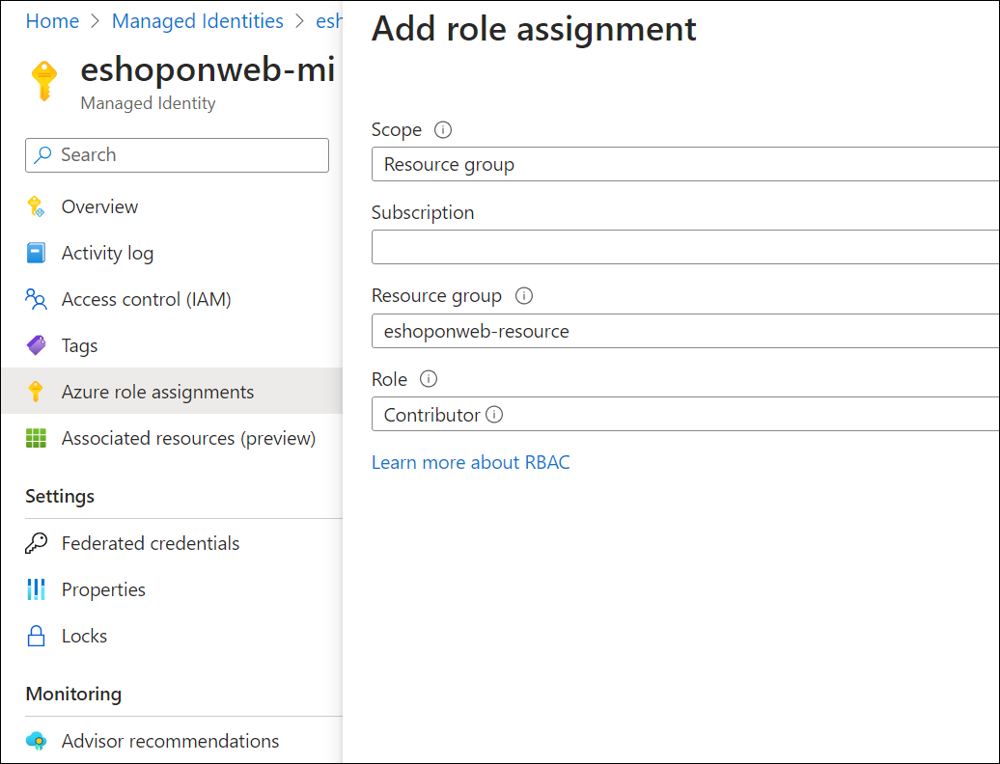
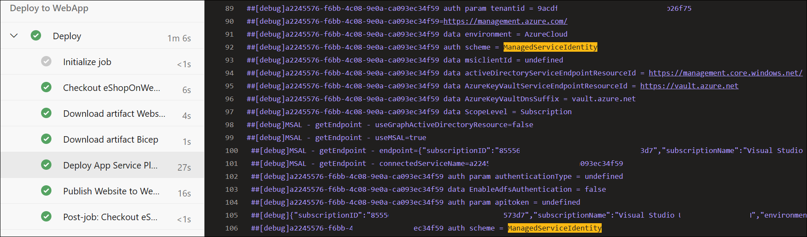

---
lab:
    title: 'Managed identity for projects and pipelines'
    module: 'Module 2: Manage identity for projects, pipelines, and agents'
---

# Managed identity for projects and pipelines

Managed identities offer a secure method for controlling access to Azure resources. Azure handles these identities automatically, allowing you to verify access to services compatible with Azure AD authentication. This means you won't need to embed credentials into your code, enhancing security. In Azure DevOps, managed identities can authenticate Azure resources within your self-hosted agents, simplifying access control without compromising security.

In this lab, you'll create a managed identity and use it in Azure DevOps YAML pipelines running on self-hosted agents to deploy Azure resources.

The lab takes approximately **45** minutes.

## Before you start

You'll need an Azure subscription, Azure DevOps organization, and the eShopOnWeb application to follow the labs.

- Follow the steps to [validate your lab environment](APL2001_M00_Validate_Lab_Environment.md).
- Verify that you have a Microsoft account or a Microsoft Entra account with the Contributor or the Owner role in the Azure subscription. For details, refer to [List Azure role assignments using the Azure portal](https://learn.microsoft.com/azure/role-based-access-control/role-assignments-list-portal) and [View and assign administrator roles in Azure Active Directory](https://learn.microsoft.com/azure/active-directory/roles/manage-roles-portal).
- Complete the lab [Configure agents and agent pools for secure pipelines](APL2001_M03_L02_Configure_Agents_And_Agent_Pools_for_Secure_Pipelines.md).

## Instructions

### Exercise 1: Import and run CI/CD Pipelines

In this exercise, you will import and run the CI pipeline, configure the service connection with your Azure Subscription and then import and run the CD pipeline.

#### Task 1: Import and run the CI pipeline

Let's start by importing the CI pipeline named [eshoponweb-ci.yml](https://github.com/MicrosoftLearning/eShopOnWeb/blob/main/.ado/eshoponweb-ci.yml).

1. Navigate to the Azure DevOps portal at `https://dev.azure.com` and open your organization.

1. Open the **eShopOnWeb** project.

1. Go to **Pipelines > Pipelines**.

1. Select **Create Pipeline** button.

1. Select **Azure Repos Git (Yaml)**.

1. Select the **eShopOnWeb** repository.

1. Select **Existing Azure Pipelines YAML File**.

1. Select the **/.ado/eshoponweb-ci.yml** file then click on **Continue**.

1. Select the **Run** button to run the pipeline.

   > [!NOTE]
   > Your pipeline will take a name based on the project name. Rename it for identifying the pipeline better.

1. Go to **Pipelines > Pipelines**, select the recently created pipeline, select the ellipsis and then select **Rename/move** option.

1. Name it **eshoponweb-ci** and select **Save**.

> [!NOTE]
> Before you proceed, verify that you already have a service connection to your Azure subscription named **azure subs**. If not, rerun exercise 2, task 2 of the previous lab of this course **Configure a project and repository structure to support secure pipelines**.

> [!NOTE]
> You will also need the value of your subscription ID, which you retrieved as part of validating your lab environment.

#### Task 2: Import and run the CD pipeline

> [!NOTE]
> In this task, you will import and run the CD pipeline named [eshoponweb-cd-webapp-code.yml](https://github.com/MicrosoftLearning/eShopOnWeb/blob/main/.ado/eshoponweb-cd-webapp-code.yml).

1. On the **Pipelines** pane of the **eShopOnWeb** project, select the **New pipeline** button.

1. Select **Azure Repos Git (Yaml)**.

1. Select the **eShopOnWeb** repository.

1. Select **Existing Azure Pipelines YAML File**.

1. Select the **/.ado/eshoponweb-cd-webapp-code.yml** file then select **Continue**.

1. In the YAML pipeline definition, set the variables section to:

   ```yaml
   variables:
     resource-group: 'AZ400-EWebShop-NAME'
     location: 'southcentralus'
     templateFile: '.azure/bicep/webapp.bicep'
     subscriptionid: 'YOUR-SUBSCRIPTION-ID'
     azureserviceconnection: 'azure subs'
     webappname: 'az400-webapp-NAME'
   ```

1. In the variables section, replace the placeholders with the following values:

   - **AZ400-EWebShop-NAME** with the name of your preference, for example, **rg-eshoponweb**.
   - **location** with the name of the Azure region you want to deploy your resources, for example, **southcentralus**.
   - **YOUR-SUBSCRIPTION-ID** with your Azure subscription id.
   - **az400-webapp-NAME**, with a globally unique name of the web app to be deployed, for example, the string **eshoponweb-lab-id-** followed by a random six-digit number. 

1. Select **Save and Run** and choose to commit directly to the main branch.

1. Select **Save and Run** again.

1. Open the pipeline. If you see the message "This pipeline needs permission to access a resource before this run can continue to Deploy to WebApp", selet **View**, **Permit** and **Permit** again. This is needed to allow the pipeline to create the Azure App Service resource.

   

1. The deployment may take a few minutes to complete, wait for the pipeline to execute. The CD definition consists of the following tasks:

   - **AzureResourceManagerTemplateDeployment**: Deploys the Azure App Service web ppp using bicep template.
   - **AzureRmWebAppDeployment**: Publishes the Web site to the Azure App Service web app.

> [!NOTE]
> In case the deployment fails, navigate to the pipeline run page and select **Rerun failed jobs** to invoke another pipeline run.

1. Your pipeline will take a name based on the project name. Let's **rename** it for identifying the pipeline better.

1. Go to **Pipelines > Pipelines**, select the recently created pipeline, select the ellipsis and then select **Rename/move** option.

1. Name it **eshoponweb-cd-webapp-code** and then select **Save**.

### Exercise 2: Configure managed identity in Azure pipelines

In this exercise, you will use a managed identity to configure a new service connection and incorporate it the CI/CD pipelines.

#### Task 1: Configure a self-hosted agent to use managed identity and update the CI pipeline

1. In your browser, open the Azure Portal at `https://portal.azure.com`.

1. In the Azure portal, navigate to the page displaying the Azure VM **eshoponweb-vm** you deployed in this lab

1. On the **eshoponweb-vm** Azure VM page, in the toolbar, select **Start** to start it.

1. On the **eshoponweb-vm** Azure VM page, in the vertical menu on the left side, in the **Security** section, select **Identity**.

1. On the **eshoponweb-vm /| Identity** page, verify that the **Status** is to **On** and select **Azure role assignments**.

1. Select the **Add role assignment** button, and perform the following actions:

   | Setting | Action |
   | -- | -- |
   | **Scope** drop-down list | Select **Resource Group**. |
   | **Subscription** drop-down list | Select your Azure subscription. |
   | **Resource group** drop-down list | Select the resource group where you deployed the web app in the previous exercise of this lab (**rg-eshoponweb**). |
   | **Role** drop-down list | Select the **Contributor** role. |

1. Select the **Save** button.

    

#### Task 2: Create a managed identity-based service connection

1. Switch to the web browser displaying the **eShopOnWeb** project in the Azure DevOps portal at `https://dev.azure.com`.

1. In the **eShopOnWeb** project, navigate to **Project settings > Service connections**.

1. Select the **New service connection** button and select **Azure Resource Manager**.

1. Select **Managed Identity** as the **Authentication method**.

1. Set the scope level to **Subscription** and provide the information gathered during the validate your lab environment stage, including subscription Id, subscription name, and tenant Id. 

1. In **Service connection name** type **azure subs managed**. This name will be referenced in YAML pipelines when accessing your Azure subscription.

1. Select **Save**.

#### Task 3: Update the CD pipeline

1. Switch to the browser window displaying the **eShopOnWeb** project in the Azure DevOps portal.

1. On the **eShopOnWeb** project page, navigate to **Pipelines > Pipelines**.

1. Select the **eshoponweb-cd-webapp-code** pipeline and select **Edit**.

1. In the variables section, update the **serviceConnection** variable to use the name of the service connection you created in the previous task, **azure subs managed**.

   ```yaml
     azureserviceconnection: 'azure subs managed'
   ```

1. In the **jobs** subsection of the **stages** section, update the value of the **pool** property to reference the self-hosted agent pool you created in the previous lab, **eShopOnWebSelfPool**, so it has the following format:

   ```yaml
     jobs:
     - job: Deploy
       pool: eShopOnWebSelfPool
       steps:
       #download artifacts
       - download: eshoponweb-ci
   ```

1. Select **Save** and choose to commit directly to the main branch.

1. Select **Save** again.

1. Select to **Run** the pipeline, and then click on **Run** again.

1. Open the pipeline. If you see the message "This pipeline needs permission to access a resource before this run can continue to Deploy to WebApp", select on **View**, **Permit** and **Permit** again. This is needed to allow the pipeline to create the Azure App Service resource.

1. The deployment may take a few minutes to complete, wait for the pipeline to execute.

1. You should see from the pipeline logs that the pipeline is using the managed identity.

   

   > [!NOTE]
   > After the pipeline finishes, you can use the Azure portal to verify the state of the App Service web app resources.

### Exercise 3: Perform cleanup of Azure and Azure DevOps resources

In this exercise, you will perform post-lab cleanup of the Azure and Azure DevOps resources created in this lab.

#### Task 1: Stop and deallocate Azure VM

1. In the Azure portal, navigate to the page displaying the resource group **rg-eshoponweb-agentpool** and select **Delete resource group** to delete all of its resources.

1. Navigate to the page displaying the resource group **rg-eshoponweb** and select **Delete resource group** to delete all of its resources.

   > [!WARNING]
   > Always remember to remove any created Azure resources that you no longer use. Removing unused resources ensures you will not see unexpected charges.

#### Task 2: Remove Azure DevOps pipelines

1. Navigate to the Azure DevOps portal at `https://dev.azure.com` and open your organization.

1. Open the **eShopOnWeb** project.

1. Go to **Pipelines > Pipelines**.

1. Go to **Pipelines > Pipelines** and delete the existing pipelines.

#### Task 3: Recreate the Azure DevOps repo

1. In the Azure DevOps portal, in the **eShopOnWeb** project, select **Project settings** in the lower left corner.

1. In the **Project setttings** vertical menu on the left side, in the **Repos** section, select **Repositories**.

1. In the **All Repositories** pane, hover over the far right end of the **eShopOnWeb** repo entry until the **More options** ellipsis icon appears, select it, and, in the **More option** menu, select **Rename**.  

1. In the **Rename the eShopOnWeb repository** window, in the **Repository name** text box, enter **eShopOnWeb_old** and select **Rename**.

1. Back in the **All Repositories** pane, select **+ Create**.

1. In the **Create a repository** pane, in the **Repository name** text box, enter **eShopOnWeb**, uncheck the **Add a README** checkbox, and select **Create**.

1. Back in the **All Repositories** pane, hover over the far right end of the **eShopOnWeb_old** repo entry until the **More options** ellipsis icon appears, select it, and, in the **More option** menu, select **Delete**.  

1. In the **Delete eShopOnWeb_old repository** window, enter **eShopOnWeb_old** and select **Delete**.

1. In the left navigational menu of the Azure DevOps portal, select **Repos**.

1. In the **eShopOnWeb is empty. Add some code!** pane, select **Import a repository**.

1. On the **Import a Git Repository** window, paste the following URL `https://github.com/MicrosoftLearning/eShopOnWeb` and select **Import**:

## Review

In this lab, you learned how to use a managed identity assigned to self-hosted agents in Azure DevOps YAML pipelines.