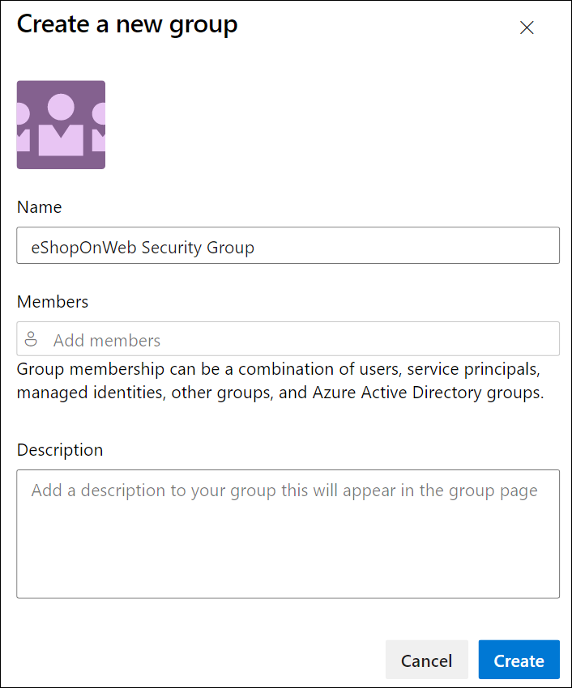
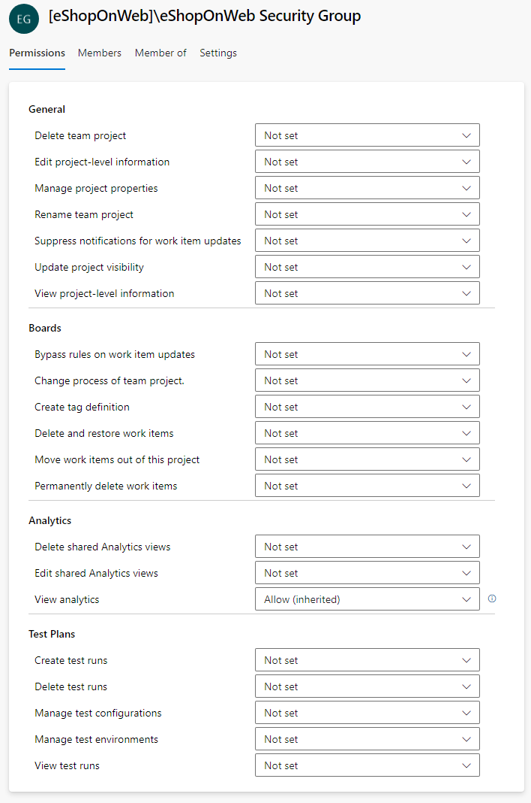

---
lab:
    title: Configure agents and agent pools for secure pipelines
    module: 'Module 2: Configure secure access to pipeline resources'
---

# Configure agents and agent pools for secure pipelines

In this lab, you will learn how to configure Azure DevOps agents and agent Pools and manage permissions for those pools. Azure DevOps Agent Pools provide the resources to run your build and release pipelines.

These exercises take approximately **25** minutes.

## Before you start

You'll need an Azure subscription, Azure DevOps organization, and the eShopOnWeb application to follow the labs.

- Follow the steps to [validate your lab environment](APL2001_M00_Validate_Lab_Environment.md).

## Instructions

You'll create agents and configure self-hosted agents using Windows. If you want to configure agents on Linux or MacOS, follow the instructions in the [Azure DevOps documentation](https://docs.microsoft.com/azure/devops/pipelines/agents/v2-linux).

During the configuration, keep in mind the following:

- **Maintain separate agents per project**: Each agent can only be tied to one pool. While sharing agent pools across projects can save on infrastructure costs, it also creates the risk of lateral movement. Therefore, it's best to have separate agent pools with dedicated agents for each project to prevent cross-contamination.
- **Utilize low-privileged accounts for running agents**: Running an agent under an identity with direct access to Azure DevOps resources can pose security threats. Operating the agent under a non-privileged local account like Network Service is advisable, which minimizes the risk.
- **Beware of misleading group names**: The "Project Collection Service Accounts" group in Azure DevOps is a potential security risk. Running agents using an identity that's part of this group and backed by Azure AD can jeopardize the security of your entire Azure DevOps organization.
- **Avoid high-privileged accounts for self-hosted agents**: Using high-privileged accounts to run self-hosted agents, particularly for accessing secrets or production environments, can expose your system to severe threats if a pipeline is compromised.
- **Prioritize security**: To safeguard your systems, use the least privileged account to run self-hosted agents. For instance, consider using your machine account or a managed service identity. It's also advisable to allow Azure Pipelines to handle access to secrets and environments.

### Exercise 1: Create agents and configure agent pools

In this exercise, you will create an Azure virtual machine (VM) and use it to create an agent and configure agent pools.

#### Task 1: Create and connect to an Azure VM

1. In your browser, open the Azure Portal at `https://portal.azure.com`. If prompted, sign in by using an account with the Owner role in your Azure subscription.

1. In the **Search resources, services and docs (G+/)** box, type **Virtual Machines** and select it from the dropdown list.

1. Select the **Create** button.

1. Select the **Azure virtual machine with preset configuration**.

    

1. Select the **Dev/Test** as the workload environment and the **General purpose** as the workload type.

1. Select the **Continue to create a VM** button, on the **Basics** tab perform the following actions and then select **Management**:

   | Setting | Action |
   | -- | -- |
   | **Subscription** drop-down list | Select your Azure subscription. |
   | **Resource group** section | Create a new resource group named **rg-eshoponweb-agentpool**. |
   | **Virtual machine name** text box | Enter name of your preference, for example, **eshoponweb-vm**. |
   | **Region** drop-down list | Select the same Azure region you used earlier in this lab. |
   | **Availability options** drop-down list | Select **No infrastructure redundancy required**. |
   | **Security type** drop-down list | Select with the **Trusted launch virtual machines** option. |
   | **Image** drop-down list | Select the **Windows Server 2022 Datacenter: Azure Edition - x64 Gen2** image. |
   | **Size** drop-down list | Select the cheapest **Standard** size for testing purposes. |
   | **Username** text box | Enter the username of your preference |
   | **Password** text box | Enter the password of your preference |
   | **Public inbound ports** section | Select **Allow selected ports**. |
   | **Select inbound ports** drop-down list | Select **RDP (3389)**. |

1. On the **Management** tab, in the **Identity** section, select the **Enable system assigned managed identity** checkbox and then select **Review + create**:

1. On the **Review + create** tab, select **Create**.

   > [!NOTE]
   > Wait for the provisioning process to complete. This should take about 2 minutes.

1. In the Azure portal, navigate to the page displaying configuration of the newly created Azure VM. 

1. On the Azure VM page, select **Connect**, in the drop-down menu, select **Connect**, then select **Download RDP file**, and use the downloaded RDP file to establish a Remote Desktop session to the operating system running in the Azure VM.

#### Task 2: Create an agent pool

1. In the Remote Desktop session to the Azure VM, start Microsoft Edge web browser.

1. In the web browser, navigate to the Azure DevOps portal at `https://dev.azure.com` and sign in to access your organization.

1. Open the **eShopOnWeb** project, and select **Project settings** from the left-side bottom menu.

1. From **Pipelines > Agent Pools**, select the **Add pool** button.

1. Choose the **Self-hosted** pool type.

1. Provide a name for the agent pool, such as **eShopOnWebSelfPool**, and add an optional description.

1. Leave the **Grant access permission to all pipelines** option unchecked.

   

1. Select **Create** button to create the agent pool.

#### Task 3: Download and extract the agent installation files

1. In the Azure DevOps portal, select the newly created agent pool and then select the **Agents** tab.

1. Select the **New agent** button and then **Download** button from the **Download agent** in the new pop-up window.

   > [!NOTE]
   > Follow the installation instructions to install the agent.

1. Start a PowerShell session and run the following commands to create a folder named **agent**.

   ```powershell
   mkdir agent ; cd agent        
   ```

   > [!NOTE]
   > Make sure you are in the root folder of your user profile or the folder where you want to install the agent.

1. Run the following command to extract the content of the downloaded agent installer files:

   ```powershell
   Add-Type -AssemblyName System.IO.Compression.FileSystem ; [System.IO.Compression.ZipFile]::ExtractToDirectory("$HOME\Downloads\vsts-agent-win-x64-3.232.0.zip", "$PWD")
   ```

   > [!NOTE]
   > If you downloaded the agent to a different location (or the downloaded version differs), adjust the above command accordingly.

#### Task 3: Create a PAT token

> [!NOTE]
> Before configuring the agent, you need to create a PAT token (unless you have an existing one). To create a PAT token, follow the steps below:

1. Within the Remote Desktop session to the Azure VM, open another browser window, navigate to the Azure DevOps portal at `https://dev.azure.com`, and access your organization.

1. Select **User settings** from the right-side top menu (directly to the left of your user's avatar icon).

1. Select the **Personal access tokens** menu item.

   

1. Select the **New Token** button.

1. Provide a name for the token, such as **eShopOnWebToken**.

1. Select the Azure DevOps organization for you want to use the token.

1. Set the expiration date for the token (only used to configure the agent).

1. Select the custom defined scope.

1. Select to show all scopes.

1. Select the **Agent Pools (Read & Manage)** scope.

1. Select the **Create** button to create the token.

1. Copy the token value and save it in a safe place (you will not be able to see it again. You can only regenerate the token).

   

   > [!IMPORTANT]
   > Use the least privilege option, **Agent Pools (Read & Manage)**, only for the agent configuration. Also, make sure you set the minimum expiration date for the token if that is the only purpose of the token. You can create another token with the same privileges if you need to configure the agent again.

#### Task 4: Configure the agent

1. Within the Remote Desktop session to the Azure VM, switch back to the Powershell window. If necessary, change the current directory to the one into which you extracted the agent installation files earlier in this exercise. 

1. To configure your agent to run unattended, invoke the following command:

   ```powershell
   .\config.cmd
   ```

   > [!NOTE]
   > If you want to run the agent interactively, use `.\run.cmd` instead. 

1. To configure the agent, perform the following actions when prompted:

   - Enter the URL of the Azure DevOps organization (**server URL**) in the format `https://dev.azure.com/`{your organization name}.
   - Accept the default authentication type (**PAT**).
   - Enter the value of the PAT token you created in the previous step.
   - Enter the agent pool name **eShopOnWebSelfPool** you created earlier in this exercise.
   - Enter the agent name **eShopOnWebSelfAgent**.
   - Accept the default agent work folder (_work).
   - Enter **Y** to configure the agent to run as service.
   - Enter **Y** to enable SERVICE_SID_TYPE_UNRESTRICTED for the agent service.
   - Enter **NT AUTHORITY\SYSTEM** to set the security context for the service.

   > [!IMPORTANT]
   > In general, you should follow the principle of least privilege when configuring the service security context.

   - Accept the default option (**N**) to allow the service to start immediately after configuration is finished.

   

1. Check the agent status by switching to the web browser displaying the Azure DevOps portal, navigating to the agent pool and clicking on the **Agents** tab. You should see the new agent in the list.

   

   > [!NOTE]
   > For more details on Windows agents, see: [Self-hosted Windows agents](https://learn.microsoft.com/azure/devops/pipelines/agents/windows-agent)

   > [!IMPORTANT]
   > In order for the agent to be able to build and deploy Azure resources from the Azure DevOps pipelines (which you will step through in the upcoming labs), you need to install Azure CLI within the operating system of the Azure VM that is hosting the agent.

1. Start a web browser and navigate to the page [Install Azure CLI on Windows](https://learn.microsoft.com/en-us/cli/azure/install-azure-cli-windows?tabs=azure-cli#install-or-update).

1. Download and install Azure CLI. 

1. In the web browser navigate to the page Microsoft .NET 7.0 SDK installer page at `https://dotnet.microsoft.com/en-us/download/dotnet/thank-you/sdk-7.0.404-windows-x64-installer`.

1. Download and install Microsoft .NET 7.0 SDK.

### Exercise 2: Create and configure a new security group for the agent pool

In this exercise, you will create a new security group for the agent pool.

#### Task 1: Create a new security group

1. Within the Remote Desktop session to the Azure VM, in the web browser displaying the Azure DevOps portal, in the **Project settings** pane, in the **General** section, select **Permissions **.

1. Select the **New Group** button.

1. Provide a name for the group, such as **eShopOnWeb Security Group**.

1. Select the **Create** button to create the group.

   

#### Task 2: Configure the security group

1. In the web browser window displaying the Azure Devops portal, select the new group to display its **Permissions** tab.

1. Deny unnecessary permissions for the group, such as **Rename team project**, **Permanently delete work items**, or any other permissions you don't want the group to have since we assume it will be used only for the agent pool.

   

   > [!IMPORTANT]
   > If you leave permissions you don't want the group to have, scripts or tasks running on the agent can use the group permissions to perform actions you don't want them to perform.

### Exercise 3: Manage agent pool permissions

In this exercise, you will manage permissions for the agent pool.

1. In the web browser window displaying the Azure Devops portal, in the **Project settings** of the **eShopOnWeb** project, in the **Pipelines** section, select **Agent pools**.

1. Select the **eShopOnWebSelfPool** agent pool.

1. In the agent pool details view, select the **Security** tab.

1. Select the **Add** button and add the new group **eShopOnWeb Security Group** to the agent pool's user permissions.

1. Choose the appropriate role for the user or group, such as Agent Pool Reader, User or Administrator. In this case, choose **User**.

1. Select **Add** to apply the permissions.

   

You are now ready to securely use the agent pool in your pipelines. For more details on agent pools, see: [Agent pools](https://learn.microsoft.com/azure/devops/pipelines/agents/pools-queues).

### Exercise 4: Perform cleanup of Azure and Azure DevOps resources

In this exercise, you will perform post-lab cleanup of some of the Azure DevOps resources created in this lab.

#### Task 1: Stop and deallocate Azure VM

> [!NOTE]
> You will be using the Azure VM you created in this lab in the next lab, so rather than deleting it, you will stop and deallocate it to eliminate its compute charges.

1. In the Azure portal, navigate to the page displaying the Azure VM **eshoponweb-vm** you deployed in this lab

1. On the **eshoponweb-vm** Azure VM page, in the toolbar, select **Stop** to stop and deallocate it.

#### Task 2: Remove Azure DevOps resources

> [!NOTE]
> You will be using the self-hosted agent you created in this lab in the next lab, so rather than deleting it, you will only revoke the Personal Access Token used to configure it. This will not prevent it from running later.

1. In the Azure DevOps portal, select **User settings** from the right-side top menu (directly to the left of your user's avatar icon).

1. Select the **Personal access tokens** menu item.

   

1. Select the **eShopOnWebToken** entry. 

1. Select **Revoke** and, when prompted to confirm, select **Revoke** again.

## Review

In this lab, you learned how to configure Azure DevOps self-hosted agent and agent pools and manage permissions for those pools. By managing permissions effectively, you can ensure that the right users have access to the resources they need while maintaining the security and integrity of your DevOps processes.
