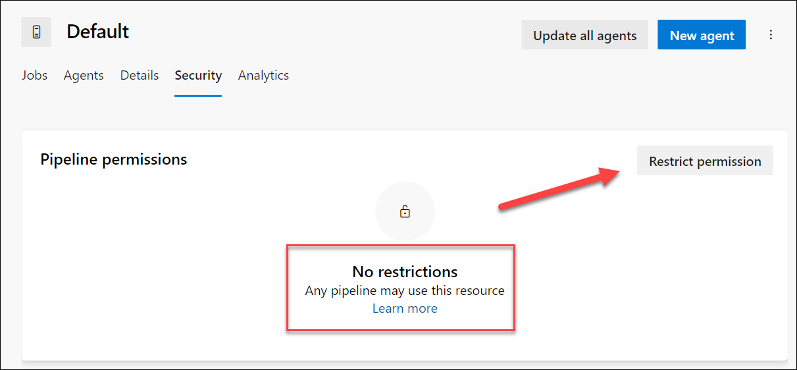
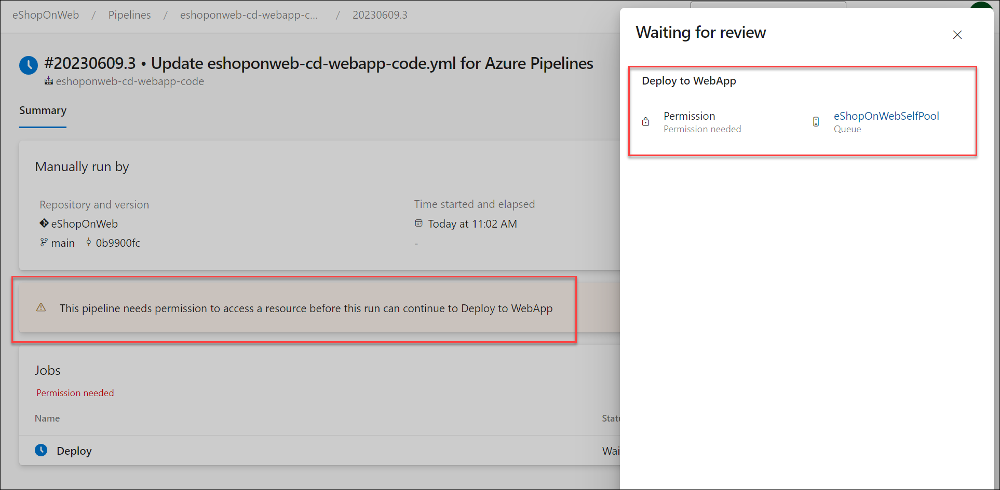
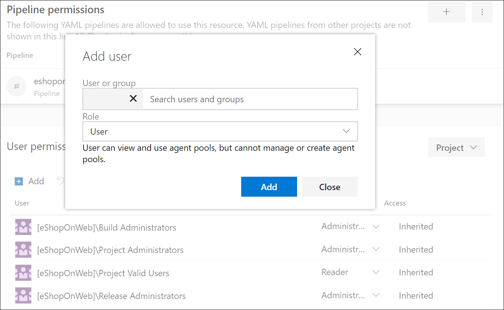

---
lab:
    title: 'Lab: Configure and validate permissions'
    module: 'Module 3: Configure and validate permissions'
---

# Lab: Configure and validate permissions

In this lab, ab covers critical concepts and best practices for configuring and validating user permissions, pipeline permissions, approval and branch checks, and auditing and managing permissions.

These exercises take approximately **30** minutes.

## Before you start

You'll need an Azure subscription, Azure DevOps organization, and the eShopOnWeb application to follow the labs.

- Follow the steps to [validate your lab environment](APL2001_M00_Validate_Lab_Environment.md).

## Instructions

In this lab, you'll set up a secure environment that adheres to the principle of least privilege, ensuring that each member can access only the resources they need to perform their tasks, thereby minimizing potential security risks. This involves configuring and validating user and pipeline permissions, setting up approval and branch checks, and auditing the permissions in Azure DevOps.

### Exercise 1: Import CI pipeline and configure pipeline specific permissions

In this exercise, you will import and run the CI pipeline for the eShopOnWeb application, and configure pipeline specific permissions.

#### Task 1: Import and run the CI pipeline

> [!NOTE]
> Skip the import if already done in another lab.

Start by importing the CI pipeline named [eshoponweb-ci.yml](https://github.com/MicrosoftLearning/eShopOnWeb/blob/main/.ado/eshoponweb-ci.yml).

1. Open a browser and go to the eShopOnWeb project in Azure DevOps.
2. Go to **Pipelines > Pipelines**.
3. Click on **New Pipeline** button.
4. Select **Azure Repos Git (Yaml)**.
5. Select the **eShopOnWeb** repository.
6. Select **Existing Azure Pipelines YAML File**.
7. Select the **/.ado/eshoponweb-ci.yml** file then click on **Continue**.
8. Click the **Run** button to run the pipeline.
9. Your pipeline will take a name based on the project name. Rename it for identifying the pipeline better. Go to **Pipelines > Pipelines** and click on the recently created pipeline. Click on the ellipsis and **Rename/Remove** option. Name it **eshoponweb-ci** and click on **Save**.

### Task 2: Configure and run the pipeline with specific permissions

In this task, you will configure the CI pipeline to run with a specific agent pool, and validate the permissions to run the pipeline. You need to have permissions to edit the pipeline and to add permissions to the agent pool.

1. Go to Project Settings, and select **Agent Pools** under **Pipelines**.
2. Open the **Default** agent pool.
3. Click on **Security** tab.
4. If there is no restriction on the agent pool, click on Restrict permissions button.

    
5. Click on **Add** button and select the **eshoponweb-ci** pipeline to add it to the list of pipelines with access to the agent pool.
6. Back to the **eshoponweb-ci** pipeline, click on **Edit** button.
7. Update the YAML file to use the **Default** agent pool. Replace the **pool** section with the following code:

    ```yaml
    pool: Default

    ```

    > [!NOTE]
    > To run the pipeline with the self-hosted agent, you will need to have the agent running and all the prerequisites installed, for example, Visual Studio to build the solution.

8. Click on **Save**, choose to commit directly to the main branch, or create a new branch.

    > [!NOTE]
    > If you choose to create a new branch, you will need to create a pull request to merge the changes to the main branch.

9. Click on **Run** button to run the pipeline.
10. Open the in progress pipeline. If you see the message "This pipeline needs permission to access a resource before this run can continue to Build .Net Core Solution", click on **View**, **Permit** and **Permit** again.

The should be able to run the pipeline successfully.

#### Task 3: Configure the CD pipeline and validate permissions

> [!NOTE]
> Skip the import if already done in another lab.

In this task, you will configure the CD pipeline without adding any permissions to the same agent pool used by the CI pipeline. This will cause the pipeline to fail. Then, you will add the permissions to the agent pool and run the pipeline successfully.

> [!IMPORTANT]
> If you have permissions, you will be able to **Permit** the pipeline to run directly from the executing pipeline. If you don't have permissions, you will need to use another account with administration permissions to enable your pipeline to run using the specific agent as described in the previous Task 2, or to add user permissions to the agent pool.

1. Go to **Pipelines > Pipelines**.
2. Click on **New pipeline** button.
3. Select **Azure Repos Git (Yaml)**.
4. Select the **eShopOnWeb** repository.
5. Select **Existing Azure Pipelines YAML File**.
6. Select the **/.ado/eshoponweb-cd-webapp-code.yml** file then click on **Continue**.
7. In the YAML pipeline definition, in the variables section, customize:
   - **YOUR-SUBSCRIPTION-ID** with your Azure subscription id.
   - **az400eshop-NAME**, with a web app name to be deployed with a global unique name, for example, "eshoponweb-lab-YOURNAME".
   - **AZ400-EWebShop-NAME** with the name of your preference, for example, "rg-eshoponweb".

8. Update the YAML file to use the **Default** agent pool. Replace the **pool** section with the following code:

    ```yaml
    pool: Default

    ```

9. Click on **Save** and Run**.
10. Open the pipeline, and you will see the message "This pipeline needs permission to access a resource before this run can continue to Deploy Web App". Click on **View** and there will be no option to **Permit** the pipeline to run.

    

#### Task 4: Add permissions to the agent pool

In this task, you will add permissions to the agent pool to allow the CD pipeline to run.

1. Go to Project Settings, and select **Agent Pools** under **Pipelines**.
2. Open the **Default** agent pool.
3. Click on **Security** tab.
4. Under **User permissions** click on **Add** button.
5. Select the user that is running the pipeline and the **User** role, then click on **Add**.

    

6. Back to the **eshoponweb-cd-webapp-code** pipeline, click on **Run** button to run the pipeline.
7. Open the pipeline, and you will see the message "This pipeline needs permission to access a resource before this run can continue to Deploy Web App". Click on **View**, **Permit** and **Permit** again.

You should be able to run the pipeline successfully.

### Exercise 2: Configure and validate user permissions

### Exercise 3: Configure and validate approval and branch checks

### Exercise 4: Manage and audit permissions

## Review

[Review of lab]
