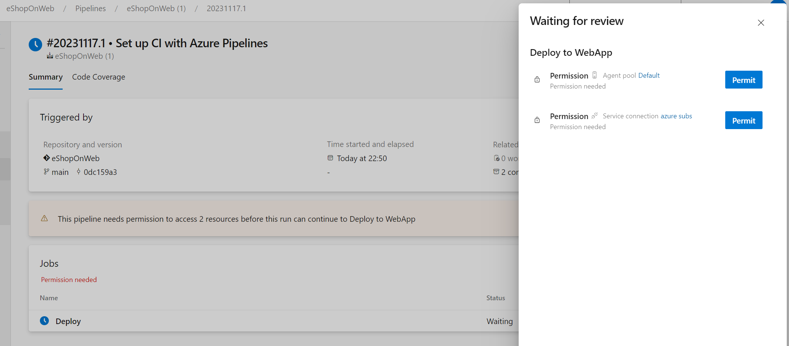
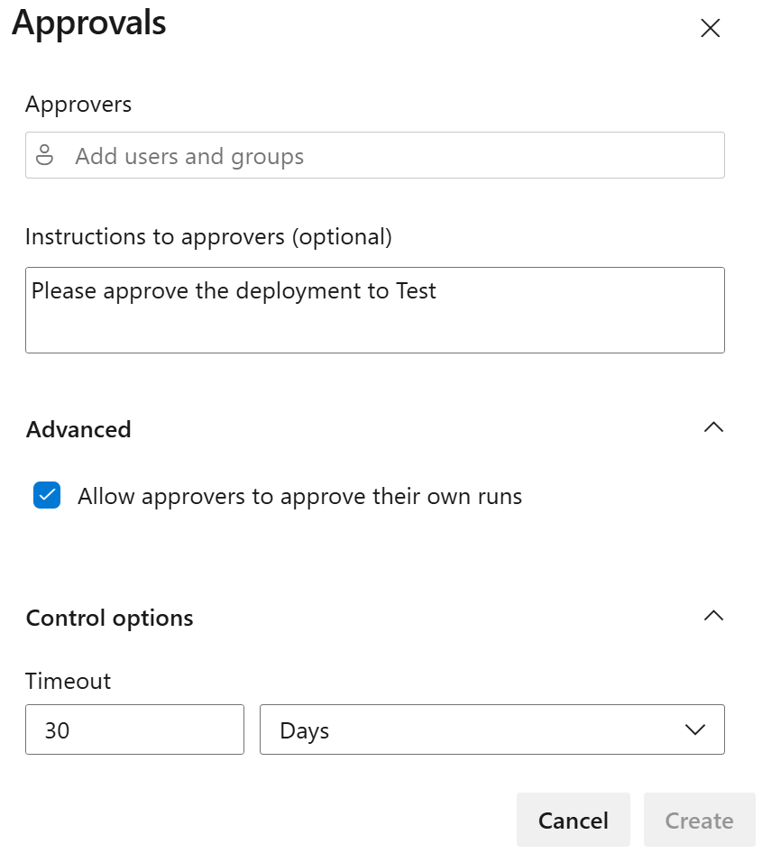
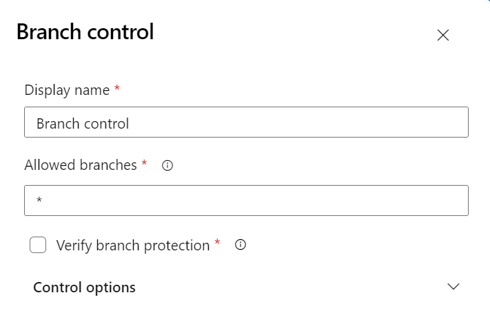
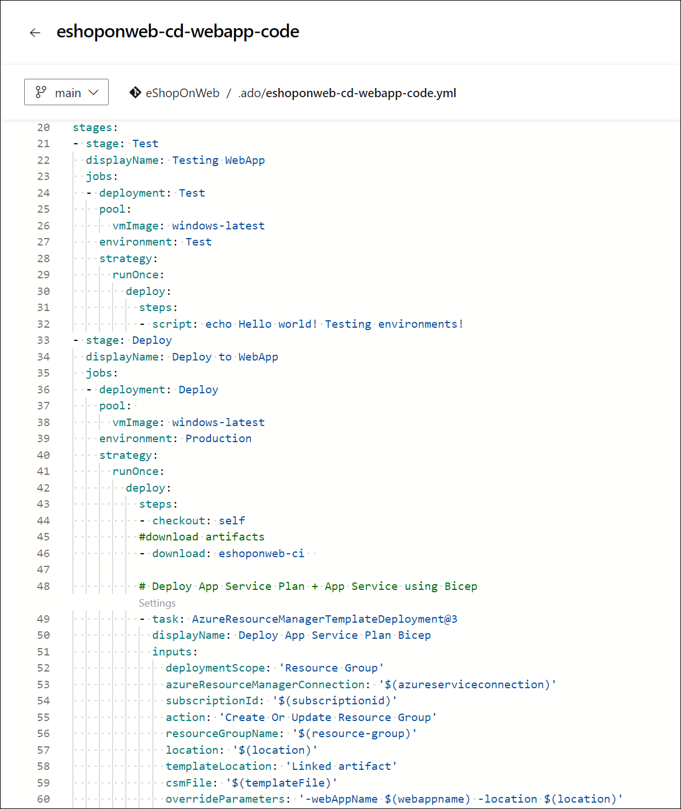
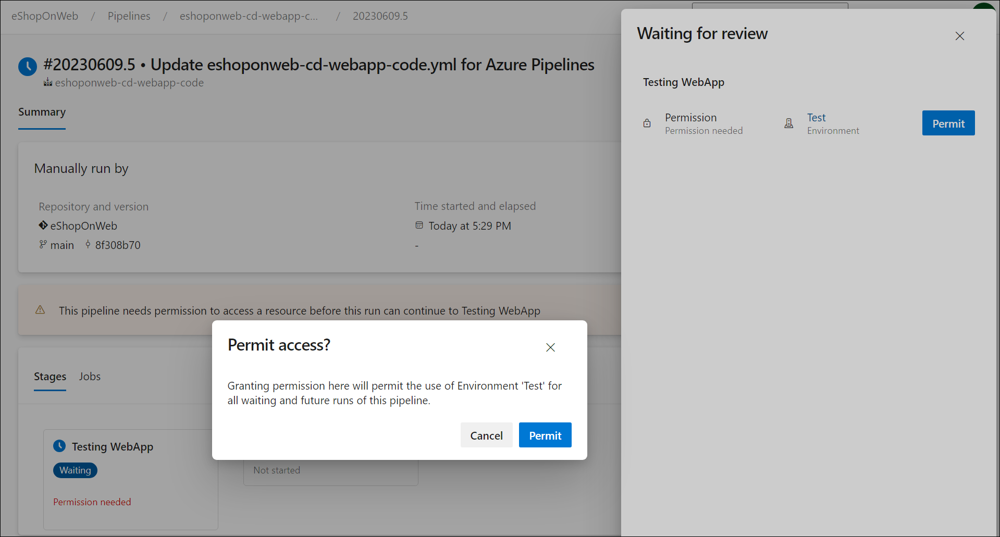
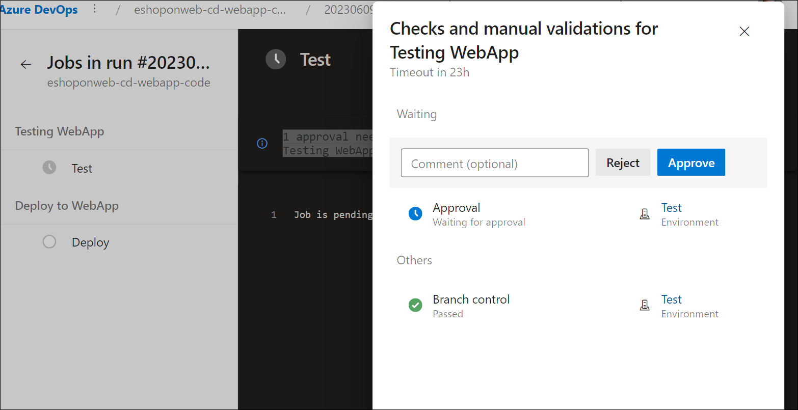
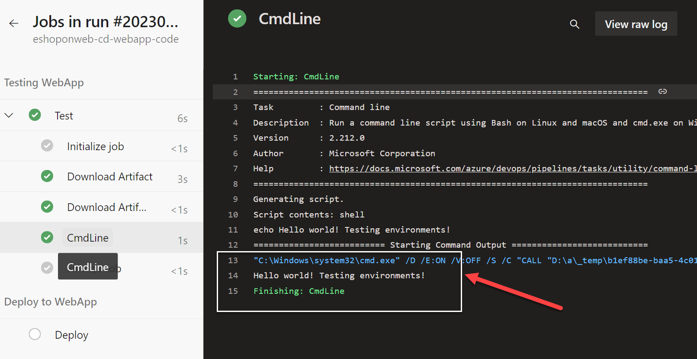
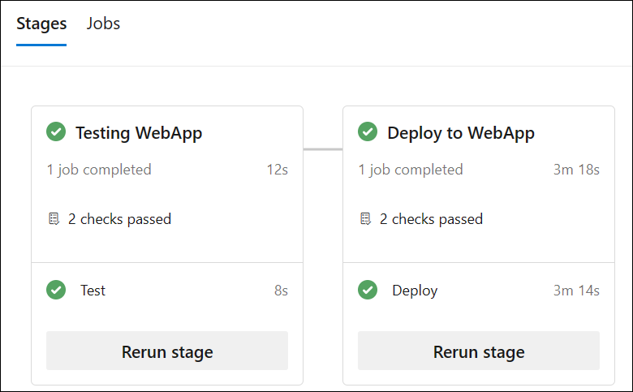

---
lab:
    title: 'Configure and validate permissions'
    module: 'Module 4: Configure and validate permissions'
---

# Configure and validate permissions

In this lab, you'll set up a secure environment that adheres to the principle of least privilege, ensuring that members can access only the resources they need to perform their tasks and minimize potential security risks. This involves configuring and validating user and pipeline permissions and setting up approval and branch checks in Azure DevOps.

These exercises take approximately **30** minutes.

## Before you start

You'll need an Azure subscription, Azure DevOps organization, and the eShopOnWeb application to follow the labs.

- Follow the steps to [validate your lab environment](APL2001_M00_Validate_Lab_Environment.md).
- Install a self-hosted agent following the lab [Configure agents and agent pools for secure pipelines](/Instructions/Labs/APL2001_M03_L03_Configure_Agents_And_Agent_Pools_for_Secure_Pipelines.md) or the steps in [Install a self-hosted agent](https://docs.microsoft.com/azure/devops/pipelines/agents/v2-windows?view=azure-devops#install).

## Instructions

### Exercise 1: Import CI pipeline and configure pipeline specific permissions

In this exercise, you will import and run the CI pipeline for the eShopOnWeb application, and configure pipeline specific permissions.

#### Task 1:  Import and run the CI pipeline

> [!NOTE]
> Start by importing the CI pipeline named [eshoponweb-ci.yml](https://github.com/MicrosoftLearning/eShopOnWeb/blob/main/.ado/eshoponweb-ci.yml).

1. Navigate to the Azure DevOps portal at `https://dev.azure.com` and open your organization.

1. Open the **eShopOnWeb** project.

1. Go to **Pipelines > Pipelines**.

1. Select **New Pipeline**.

1. Select **Azure Repos Git (Yaml)**.

1. Select the **eShopOnWeb** repository.

1. Select **Existing Azure Pipelines YAML File**.

1. Select the **/.ado/eshoponweb-ci.yml** file then select **Continue**.

1. Select the **Run** button to run the pipeline.

   > [!NOTE]
   > Your pipeline will take a name based on the project name. Rename it for identifying the pipeline better.

1. Go to **Pipelines > Pipelines**, select the recently created pipeline, select the ellipsis and then select **Rename/move** option.

1. Name it **eshoponweb-ci** and select **Save**.

### Task 2: Configure and run the pipeline with specific permissions

> [!NOTE]
> In order to use the agent pool configured in this task, you will first need to start the Azure VM hosting the agent. 

1. In your browser, open the Azure Portal at `https://portal.azure.com`.

1. In the Azure portal, navigate to the page displaying the Azure VM **eshoponweb-vm** you deployed in this lab

1. On the **eshoponweb-vm** Azure VM page, in the toolbar, select **Start** to start it.

> [!NOTE]
> Next, you will configure the CI pipeline to run with the corresponding  agent pool, and validate the permissions to run the pipeline. You need to have permissions to edit the pipeline and to add permissions to the agent pool.

1. Go to Project Settings, and select **Agent Pools** under **Pipelines**.

1. Open the **eShopOnWebSelfPool** agent pool.

1. Select **Security** tab.

1. In the **Pipeline permissions** section, select the **+** button and then select the **eshoponweb-ci** pipeline to add it to the list of pipelines with access to the agent pool.

1. Navigate to the **eShopOnWeb** project page.

1. On the **eShopOnWeb** project page, navigate to **Pipelines > Pipelines**.

1. Select the **eshoponweb-ci** pipeline and select **Edit**.

1. In the **jobs** subsection of the **stages** section, update the value of the **pool** property to reference the self-hosted agent pool **eShopOnWebSelfPool** you configured in this task, so it has the following format:

   ```yaml
     jobs:
     - job: Build
       pool: eShopOnWebSelfPool
       steps:
       - task: DotNetCoreCLI@2
   ```

1. Select **Save** and choose to commit directly to the main branch.

1. Select **Save** again.

1. Select to **Run** the pipeline, and then click on **Run** again.

1. Verify that the build jobs is running on the **eShopOnWebSelfAgent** agent. 

> [!NOTE]
> The should be able to run the pipeline successfully.

#### Task 3: Configure the CD pipeline and validate permissions

1. In the Azure DevOps portal, on the **eShopOnWeb** project page, go to **Pipelines > Pipelines**.

1. Select **New pipeline**.

1. Select **Azure Repos Git (Yaml)**.

1. Select the **eShopOnWeb** repository.

1. Select **Existing Azure Pipelines YAML File**.

1. Select the **/.ado/eshoponweb-cd-webapp-code.yml** file then select **Continue**.

1. In the YAML pipeline definition, in the variables section, customize:

   - **AZ400-EWebShop-NAME** with the name of your preference, for example, **rg-eshoponweb-perm**.
   - **Location** with the name of the Azure region you want to deploy your resources, for example, **southcentralus**.
   - **YOUR-SUBSCRIPTION-ID** with your Azure subscription id.
   - **azure subs** with **azure subs managed**
   - **az400-webapp-NAME** with a globally unique name of the web app to be deployed, for example, the string **eshoponweb-lab-perm-** followed by a random six-digit number. 

1. Update the YAML file to use the **eShopOnWebSelfPool** agent pool. To accopmlish this, set the **pool** section to the following value:

   ```yaml
     jobs:
     - job: Deploy
       pool: eShopOnWebSelfPool
       steps:
       #download artifacts
       - download: eshoponweb-ci
   ```

1. Select **Save and run** and then select **Save and run** again.

1. Open the pipeline, and you will see the message "This pipeline needs permission to access resources before this run can continue to Deploy to WebApp". Select **View** and then select **Permit** to allow the pipeline to run.

   

### Exercise 2: Configure and validate approval and branch checks

In this exercise, you will configure and validate approval and branch checks for the CD pipeline.

#### Task 1: Create a new Environment and add approvals and checks

1. Go to **Pipelines > Environments**.

1. Select **Create environment** button.

1. Name the environment **Test**, select **None** as the resource, and select **Create**.

1. Select **New environment**, create a new environment **Production**, select **None** as the resource and select **Create**.

1. Open the **Test** environment, select ***...*** and select **Approvals and checks**.

1. Select **Approvals**.

1. In the **Approvers** text box, enter your user name and, if you have another user, add it to validate the approval process.

1. Give the instructions **Please approve the deployment to Test** and select **Create**.

   

1. Select **+** button, select **Branch control**, and then select **Next**.

1. In the **Allowed branches** field, leave the default and select **Create**. You can add more branches if you want.

   

1. Open the **Production** environment, and perform the same steps to add approvals and branch control. To differentiate the environments, add the instructions **Please approve the deployment to Production** and add the **refs/heads/main** branch to the allowed branches.

1. (Optional) You can add more environments and configure approvals and branch control for them. Additionally, you can configure **Security** to add users or groups to the environment.

   - Open the **Test** environment, select ***...*** and select **Security**.
   - Select **Add** and select the user that is running the pipeline, and the role *User*, *Creator* or *Reader*.
   - Select **Add**.
   - Select **Save**.

#### Task 2: Configure the CD pipeline to use the new environment

1. Go to **Pipelines > Pipelines**.

1. Open the **eshoponweb-cd-webapp-code** pipeline.

1. Select **Edit**.

1. Above the **#download artifacts** comment, add:

   ```yaml
   stages:
   - stage: Test
     displayName: Testing WebApp
     jobs:
     - deployment: Test
       pool:
         vmImage: 'windows-latest'
       environment: Test
       strategy:
         runOnce:
           deploy:
             steps:
             - script: echo Hello world! Testing environments!
   - stage: Deploy
   displayName: Deploy to WebApp
     jobs:
     - deployment: Deploy
       pool: 
         vmImage: windows-latest
       environment: Production
       strategy:
         runOnce:
           deploy:
             steps:
             - checkout: self
   ```

   > [!NOTE]
   > You will need to shift the lines following the code above six spaces to the right to ensure that YAML indentation rules are satisfied.

   Your pipeline should look like this:

   

1. Select **Save** and **Run**.

1. Open the pipeline, and you will see the message "This pipeline needs permission to access a resource before this run can continue to Testing WebApp". Select **View**, **Permit** and **Permit** again.

   

1. Open the **Testing WebApp** stage, and you will see the message **1 approval needs your review before this run can continue to Testing WebApp**. Select **Review** and select **Approve**.

   

1. Wait for the pipeline to finish, open the pipeline log and check that the **Testing WebApp** stage was executed successfully.

   

1. Back to the pipeline and you will see the stage **Deploy to WebApp** waiting for approval. Select **Review** and **Approve** as you did before for the **Testing WebApp** stage.

1. Wait for the pipeline to finish amd check that the **Deploy to WebApp** stage was executed successfully.

   

You should be able to run the pipeline successfully with the approvals and branch checks in both environments, Test and Production.

### Exercise 3: Remove the resources used in the lab

1. In the Azure portal, open the created Resource Group and click on **Delete resource group** for all created resources in this lab.

   

   > [!WARNING]
   > Always remember to remove any created Azure resources that you no longer use. Removing unused resources ensures you will not see unexpected charges.

1. Reset the specific permissions you added to the Azure DevOps organization and project in this lab.

## Review

In this lab, you have learned how to set up a secure environment that adheres to the principle of least privilege, ensuring that members can access only the resources they need to perform their tasks and minimize potential security risks. You configured and validated user and pipeline permissions and set up approval and branch checks in Azure DevOps.
