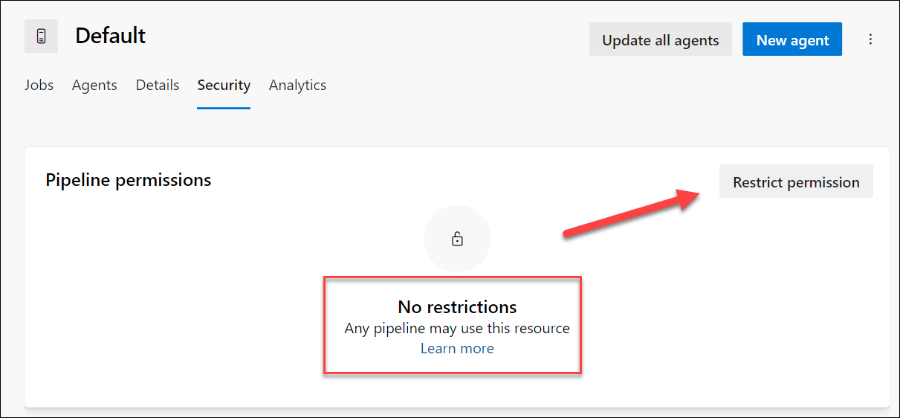

---
lab:
    title: 'Configure and validate permissions'
    module: 'Module 4: Configure and validate permissions'
---

# Configure and validate permissions

In this lab, you'll set up a secure environment that adheres to the principle of least privilege, ensuring that members can access only the resources they need to perform their tasks and minimize potential security risks. This involves configuring and validating user and pipeline permissions and setting up approval and branch checks in Azure DevOps.

These exercises take approximately **30** minutes.

## Before you start

You'll need an Azure subscription, Azure DevOps organization, and the eShopOnWeb application to follow the labs.

- Follow the steps to [validate your lab environment](APL2001_M00_Validate_Lab_Environment.md).

## Instructions

### Exercise 1: Import CI pipeline and configure pipeline specific permissions

In this exercise, you will import and run the CI pipeline for the eShopOnWeb application, and configure pipeline specific permissions.

#### Task 1: (If done, skip) Import and run the CI pipeline

> [!NOTE]
> Skip the import if already done in another lab.

Start by importing the CI pipeline named [eshoponweb-ci.yml](https://github.com/MicrosoftLearning/eShopOnWeb/blob/main/.ado/eshoponweb-ci.yml).

1. Navigate to the Azure DevOps portal at `https://dev.azure.com` and open your organization.

1. Open the **eShopOnWeb** project.

1. Go to **Pipelines > Pipelines**.

1. Select **New Pipeline** button.

1. Select **Azure Repos Git (Yaml)**.

1. Select the **eShopOnWeb** repository.

1. Select **Existing Azure Pipelines YAML File**.

1. Select the **/.ado/eshoponweb-ci.yml** file then select **Continue**.

1. Select the **Run** button to run the pipeline.

1. Your pipeline will take a name based on the project name. Rename it for identifying the pipeline better.

1. Go to **Pipelines > Pipelines**, select the recently created pipeline, select the ellipsis and then select **Rename/Remove** option.

1. Name it **eshoponweb-ci** and select **Save**.

### Task 2: Configure and run the pipeline with specific permissions

In this task, you will configure the CI pipeline to run with a specific agent pool, and validate the permissions to run the pipeline. You need to have permissions to edit the pipeline and to add permissions to the agent pool.

1. Go to Project Settings, and select **Agent Pools** under **Pipelines**.

1. Open the **Default** agent pool.

1. Select **Security** tab.

1. If there is no restriction on the agent pool, select **Restrict permissions** button.

    

1. Select **Add** button and select the **eshoponweb-ci** pipeline to add it to the list of pipelines with access to the agent pool.

1. Back to the **eshoponweb-ci** pipeline, select **Edit** button.

1. Update the YAML file to use the **Default** agent pool. Replace the **pool** section with the following code:

    ```yaml
    pool: Default

    ```

    > [!NOTE]
    > To run the pipeline with the self-hosted agent, you will need to have the agent running and all the prerequisites installed, for example, Visual Studio to build the solution.

1. Select **Save**, choose to commit directly to the main branch, or create a new branch.

    > [!NOTE]
    > If you choose to create a new branch, you will need to create a pull request to merge the changes to the main branch.

1. Select **Run** button to run the pipeline.

1. Open the in progress pipeline. If you see the message "This pipeline needs permission to access a resource before this run can continue to Build .Net Core Solution", select **View**, **Permit** and **Permit** again.

The should be able to run the pipeline successfully.

#### Task 3: (If done, skip) Configure the CD pipeline and validate permissions

> [!NOTE]
> Skip the import if already done in another lab.

In this task, you will configure the CD pipeline without adding any permissions to the same agent pool used by the CI pipeline. This will cause the pipeline to fail. Then, you will add the permissions to the agent pool and run the pipeline successfully.

> [!IMPORTANT]
> If you have permissions, you will be able to **Permit** the pipeline to run directly from the executing pipeline. If you don't have permissions, you will need to use another account with administration permissions to enable your pipeline to run using the specific agent as described in the previous Task 2, or to add user permissions to the agent pool.

1. Go to **Pipelines > Pipelines**.

1. Select **New pipeline** button.

1. Select **Azure Repos Git (Yaml)**.

1. Select the **eShopOnWeb** repository.

1. Select **Existing Azure Pipelines YAML File**.

1. Select the **/.ado/eshoponweb-cd-webapp-code.yml** file then select **Continue**.

1. In the YAML pipeline definition, in the variables section, customize:
   - **YOUR-SUBSCRIPTION-ID** with your Azure subscription id.
   - **az400eshop-NAME**, with a web app name to be deployed with a global unique name, for example, **eshoponweb-lab-YOURNAME**.
   - **AZ400-EWebShop-NAME** with the name of your preference, for example, **rg-eshoponweb**.

1. Update the YAML file to use the **Default** agent pool. Replace the **pool** section with the following code:

    ```yaml
    pool: Default

    ```

1. Select **Save** and then select **Run**.

1. Open the pipeline, and you will see the message "This pipeline needs permission to access a resource before this run can continue to Deploy Web App". Select **View** and there will be no option to **Permit** the pipeline to run.

    

#### Task 4: Add permissions to the agent pool

In this task, you will add permissions to the agent pool to allow the CD pipeline to run.

1. Go to Project Settings, and select **Agent Pools** under **Pipelines**.

1. Open the **Default** agent pool.

1. Select **Security** tab.

1. Under **User permissions** click on **Add** button.

1. Select the user that is running the pipeline and the **User** role, then select **Add**.

    

1. Back to the **eshoponweb-cd-webapp-code** pipeline, select **Run** button to run the pipeline.

1. Open the pipeline, and you will see the message "This pipeline needs permission to access a resource before this run can continue to Deploy Web App". Select **View**, **Permit** and **Permit** again.

You should be able to run the pipeline successfully.

### Exercise 2: Configure and validate approval and branch checks

In this exercise, you will configure and validate approval and branch checks for the CD pipeline.

#### Task 1: Create a new Environment and add approvals and checks

1. Go to **Pipelines > Environments**.

1. Select **New environment** button.

1. Name the environment **Test**, select **None** as the resource, and select **Create**.

1. Select **New environment**, create a new environment **Production**, select **None** as the resource and select **Create**.

1. Open the **Test** environment, select ***...*** and select **Approvals and checks**.

1. Select **Approvals**.

1. Select **Add approver** and select your user, and if you have another user, add it to validate the approval process.

1. Give the instructions **Please approve the deployment to Test** and select **Save**.

    

1. Select **+** button and select **Branch control**.

1. In the **Allowed branches** field, leave the default and select **Save**. You can add more branches if you want.

    

1. Open the **Production** environment, and perform the same steps to add approvals and branch control. To differentiate the environments, add the instructions **Please approve the deployment to Production** and add the **refs/heads/main** branch to the allowed branches.

1. (Optional) You can add more environments and configure approvals and branch control for them. Additionally, you can configure **Security** to add users or groups to the environment.
    - Open the **Test** environment, select ***...*** and select **Security**.
    - Select **Add** and select the user that is running the pipeline, and the role *User*, *Creator* or *Reader*.
    - Select **Add**.
    - Select **Save**.

#### Task 2: Configure the CD pipeline to use the new environment

1. Go to **Pipelines > Pipelines**.

1. Open the **eshoponweb-cd-webapp-code** pipeline.

1. Select **Edit**.

1. Above the **#download artifacts** comment, add:

    ```yaml
    stages:
   - stage: Test
     displayName: Testing WebApp
     jobs:
     - deployment: Test
       pool:
         vmImage: 'windows-latest'
       environment: Test
       strategy:
         runOnce:
           deploy:
             steps:
             - script: echo Hello world! Testing environments!
   - stage: Deploy
     displayName: Deploy to WebApp
     jobs:
     - deployment: Deploy
       pool:
         vmImage: 'windows-latest'
       environment: Production
       strategy:
         runOnce:
           deploy:
             steps:

    ```

    Your pipeline should look like this:

    

1. Select **Save** and **Run**.

1. Open the pipeline, and you will see the message "This pipeline needs permission to access a resource before this run can continue to Testing WebApp". Select **View**, **Permit** and **Permit** again.

    

1. Open the **Testing WebApp** stage, and you will see the message **1 approval needs your review before this run can continue to Testing WebApp**. Select **Review** and select **Approve**.

    

1. Wait for the pipeline to finish, open the pipeline log and check that the **Testing WebApp** stage was executed successfully.

    

1. Back to the pipeline and you will see the stage **Deploy to WebApp** waiting for approval. Select **Review** and **Approve** as you did before for the **Testing WebApp** stage.

1. Wait for the pipeline to finish amd check that the **Deploy to WebApp** stage was executed successfully.

    

You should be able to run the pipeline successfully with the approvals and branch checks in both environments, Test and Production.

### Exercise 3: Remove the resources used in the lab

1. In the Azure portal, open the created Resource Group and click on **Delete resource group** for all created resources in this lab.

    

    > [!WARNING]
    > Always remember to remove any created Azure resources that you no longer use. Removing unused resources ensures you will not see unexpected charges.

1. Reset the specific permissions you added to the Azure DevOps organization and project in this lab.

## Review

In this lab, you have learned how to set up a secure environment that adheres to the principle of least privilege, ensuring that members can access only the resources they need to perform their tasks and minimize potential security risks. You configured and validated user and pipeline permissions and set up approval and branch checks in Azure DevOps.
