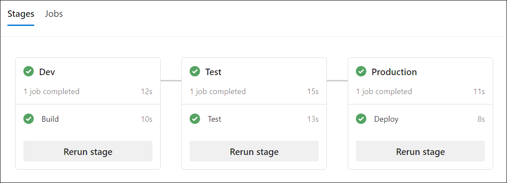
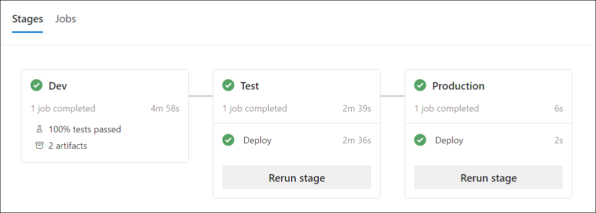

---
lab:
    title: 'Extend a pipeline to use multiple templates'
    module: 'Module 5: Extend a pipeline to use multiple templates'
---

# Extend a pipeline to use multiple templates

In this lab, explore the importance of extending a pipeline to multiple templates and how to do it using Azure DevOps. This lab covers fundamental concepts and best practices for creating a multi-stage pipeline, creating a variables template, creating a job template, and creating a stage template.

These exercises take approximately **20** minutes.

## Before you start

You'll need an Azure subscription, Azure DevOps organization, and the eShopOnWeb application to follow the labs.

- Follow the steps to [validate your lab environment](APL2001_M00_Validate_Lab_Environment.md).

## Instructions

### Exercise 1: Create a multi-stage YAML pipeline

#### Task 1: Create a multi-stage main YAML pipeline

1. Navigate to the Azure DevOps portal at `https://dev.azure.com` and open your organization.

1. Open the **eShopOnWeb** project.

1. Go to **Pipelines > Pipelines**.

1. Select **Create Pipeline**.

1. Select **Azure Repos Git (Yaml)**.

1. Select the **eShopOnWeb** repository.

1. Select **Starter pipeline**.

1. Replace the content of the **azure-pipelines.yml** file with the following code:

   ```yaml
   trigger:
   - main

   pool:
     vmImage: 'windows-latest'

   stages:
   - stage: Dev
     jobs:
     - job: Build
       steps:
       - script: echo Build
   - stage: Test
     jobs:
     - job: Test
       steps:
       - script: echo Test
   - stage: Production
     jobs:
     - job: Deploy
       steps:
       - script: echo Deploy
   ```

1. Select **Save and run**. Choose to commit directly to the main branch and select **Save and run** again.

1. You will see the pipeline running with the three stages (Dev, Test, and Production) and the corresponding jobs. Wait until the pipeline finishes and navigate back to the **Pipelines** page.

   

1. Select **...** (More options) on the right side of the pipeline you just created and select **Rename/move**.

1. Rename the pipeline to **eShopOnWeb-MultiStage-Main** and select **Save**.

#### Task 2: Create a variables template

1. Go to **Repos > Files**.

1. Expand the **.ado** folder and click on **New file**.

1. Name the file **eshoponweb-variables.yml** and click on **Create**.

1. Add the following code to the file:

   ```yaml
   variables:
     resource-group: 'YOUR-RESOURCE-GROUP-NAME'
     location: 'southcentralus' #name of the Azure region you want to deploy your resources
     templateFile: '.azure/bicep/webapp.bicep'
     subscriptionid: 'YOUR-SUBSCRIPTION-ID'
     azureserviceconnection: 'YOUR-AZURE-SERVICE-CONNECTION-NAME'
     webappname: 'YOUR-WEB-APP-NAME'
   ```

1. Replace the values of the variables with the values of your environment:

   - replace **YOUR-RESOURCE-GROUP-NAME** with the name of the resource group you want to use in this lab, for example, **rg-eshoponweb-multi**.
   - set the value of the **location** variable to the name of the Azure region you want to deploy your resources, for example, **southcentralus**.
   - replace **YOUR-SUBSCRIPTION-ID** with your Azure subscription id.
   - replace **YOUR-AZURE-SERVICE-CONNECTION-NAME** with **azure subs**
   - replace **YOUR-WEB-APP-NAME** with a globally unique name of the web app to be deployed, for example, the string **eshoponweb-lab-multi-** followed by a random six-digit number.  

1. Select **Commit**, in the commit comment text box, enter `[skip ci]`, and then select **Commit**.

   > [!NOTE]
   > By adding the `[skip ci]` comment to the commit, you will prevent automatic pipeline execution, which, at this point, runs by default following every change to the repo. 

#### Task 3: Prepare the pipeline to use templates

1. In the Azure DevOps portal, on the **eShopOnWeb** project page, go to **Repos**. 

1. In the root directory of the repo, select **azure-pipelines.yml** which contains the definition of the **eShopOnWeb-MultiStage-Main** pipeline.

1. Select **Edit**.

1. Replace the content of the **azure-pipelines.yml** file with the following code:

   ```yaml
   trigger:
   - main
   variables:
   - template: .ado/eshoponweb-variables.yml
   
   stages:
   - stage: Dev
     jobs:
     - template: .ado/eshoponweb-ci.yml
   - stage: Test
     jobs:
     - template: .ado/eshoponweb-cd-webapp-code.yml
   - stage: Production
     jobs:
     - job: Deploy
       steps:
       - script: echo Deploy to Production or Swap
   ```

1. Select **Commit**, in the commit comment text box, enter `[skip ci]`, and then select **Commit**.

#### Task 4: Updating CI/CD templates

1. In the **Repos** of the **eShopOnWeb** project, select the **.ado** directory and select the **eshoponweb-ci.yml** file.

1. Remove everything above the **jobs** section.

   ```yaml
   #NAME THE PIPELINE SAME AS FILE (WITHOUT ".yml")
   # trigger:
   # - main
   
   resources:
     repositories:
       - repository: self
         trigger: none
   
   stages:
   - stage: Build
     displayName: Build .Net Core Solution
   ```

1. Select **Commit**, in the commit comment text box, enter `[skip ci]`, and then select **Commit**.

1. In the **Repos** of the **eShopOnWeb** project, select the **.ado** directory and select the **eshoponweb-cd-webapp-code.yml** file.

1. Remove everything above the **jobs** section.

   ```yaml
   #NAME THE PIPELINE SAME AS FILE (WITHOUT ".yml")
   
   # Trigger CD when CI executed successfully
   resources:
     pipelines:
       - pipeline: eshoponweb-ci
         source: eshoponweb-ci # given pipeline name
         trigger: true

   variables:
     resource-group: 'rg-eshoponweb'
     location: 'southcentralus'
     templateFile: '.azure/bicep/webapp.bicep'
     subscriptionid: ''
     azureserviceconnection: 'azure subs'
     webappname: 'eshoponweb-lab'
     # webappname: 'webapp-windows-eshop'
   
   stages:
   - stage: Deploy
     displayName: Deploy to WebApp`
   ```

1. Replace the existing content of the **#download artifacts** step with:

   ```yaml
       - download: current
         artifact: Website
       - download: current
         artifact: Bicep
   ```

1. Select **Commit**, in the commit comment text box, enter `[skip ci]`, and then select **Commit**.

#### Task 5: Run the main pipeline

1. Go to **Pipelines > Pipelines**.

1. Open the **eShopOnWeb-MultiStage-Main** pipeline.

1. Select **Run pipeline**.

1. Once the pipeline reaches the **Deploy** stage in the **Test** environment, open the pipeline and note the message "This pipeline needs permission to access a resource before this run can continue Test". Select **View** and then select **Permit** to allow the pipeline to run.

   > [!NOTE]
   > If any jobs in the Deploy stage fail, navigate to the pipeline run page and select **Rerun failed jobs***.

1. Once the pipeline reaches the **Deploy** stage in the **Production** environment, open the pipeline and note the message "This pipeline needs permission to access a resource before this run can continue Production". Select **View** and then select **Permit** to allow the pipeline to run.

1. Wait until the pipeline finishes and check the results.

   

### Exercise 2: Perform cleanup of Azure and Azure DevOps resources

In this exercise, you will remove Azure and Azure DevOps resources created in this lab.

#### Task 1: Remove Azure resources

1. In the Azure portal, navigate to the resource group **rg-eshoponweb-multi** containing deployed resources and select **Delete resource group** to delete all resources created in this lab.

#### Task 2: Remove Azure DevOps pipelines

1. Navigate to the Azure DevOps portal at `https://dev.azure.com` and open your organization.

1. Open the **eShopOnWeb** project.

1. Go to **Pipelines > Pipelines**.

1. Go to **Pipelines > Pipelines** and delete the existing pipelines.

#### Task 3: Recreate the Azure DevOps repo

1. In the Azure DevOps portal, in the **eShopOnWeb** project, select **Project settings** in the lower left corner.

1. In the **Project setttings** vertical menu on the left side, in the **Repos** section, select **Repositories**.

1. In the **All Repositories** pane, hover over the far right end of the **eShopOnWeb** repo entry until the **More options** ellipsis icon appears, select it, and, in the **More option** menu, select **Rename**.  

1. In the **Rename the eShopOnWeb repository** window, in the **Repository name** text box, enter **eShopOnWeb_old** and select **Rename**.

1. Back in the **All Repositories** pane, select **+ Create**.

1. In the **Create a repository** pane, in the **Repository name** text box, enter **eShopOnWeb**, uncheck the **Add a README** checkbox, and select **Create**.

1. Back in the **All Repositories** pane, hover over the far right end of the **eShopOnWeb_old** repo entry until the **More options** ellipsis icon appears, select it, and, in the **More option** menu, select **Delete**.  

1. In the **Delete eShopOnWeb_old repository** window, enter **eShopOnWeb_old** and select **Delete**.

1. In the left navigational menu of the Azure DevOps portal, select **Repos**.

1. In the **eShopOnWeb is empty. Add some code!** pane, select **Import a repository**.

1. On the **Import a Git Repository** window, paste the following URL `https://github.com/MicrosoftLearning/eShopOnWeb` and select **Import**:

## Review

In this lab, you learned how to extend a pipeline into multiple templates by using Azure DevOps. This lab covered fundamental concepts and best practices for creating a multi-stage pipeline, creating a variables template, a job template, and a stage template.