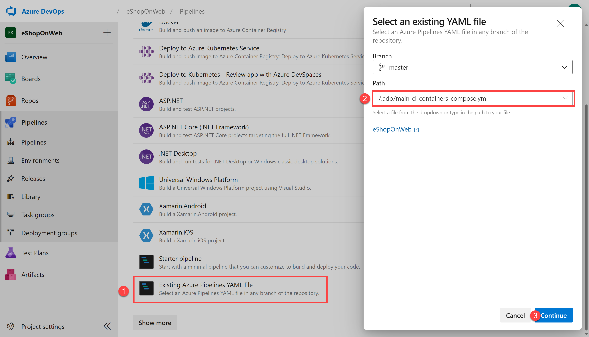
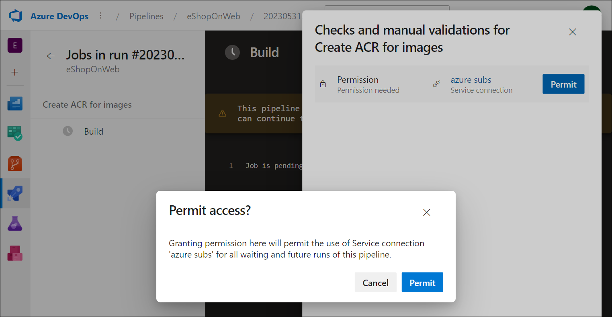
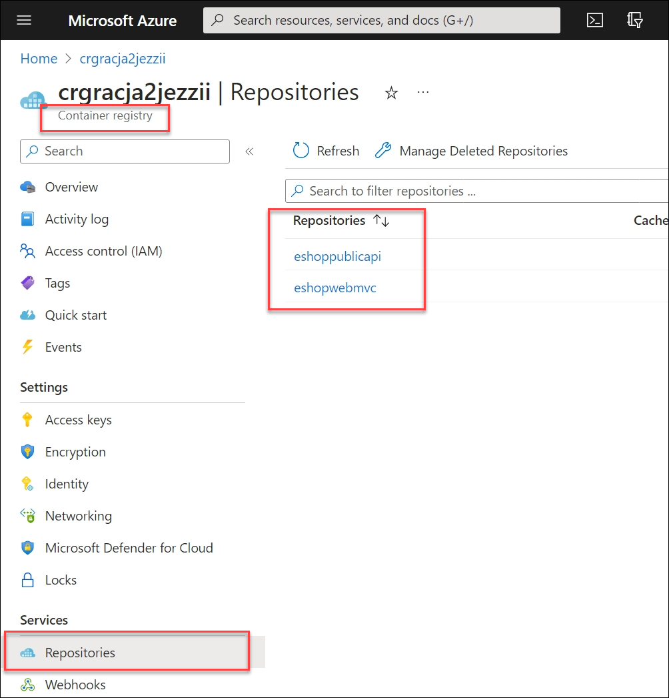
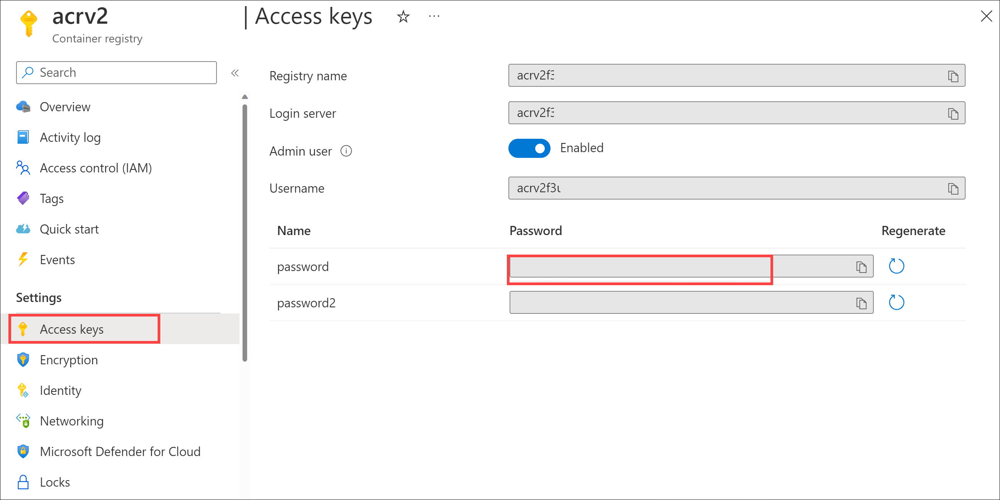
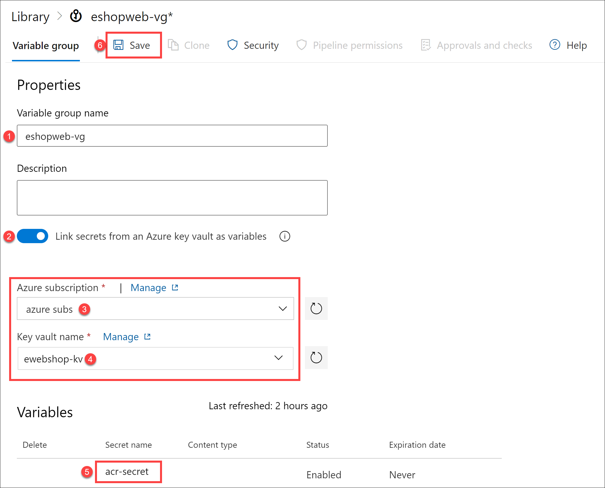

---
lab:
    title: 'Integrate Azure Key Vault with Azure Pipelines'
    module: 'Module 6: Configure secure access to Azure Repos from pipelines'
---

# Integrate Azure Key Vault with Azure Pipelines

Azure Key Vault provides secure storage and management of sensitive data, such as keys, passwords, and certificates. Azure Key Vault includes support for hardware security modules and a range of encryption algorithms and key lengths. By using Azure Key Vault, you can minimize the possibility of disclosing sensitive data through source code, a common mistake developers make. Access to Azure Key Vault requires proper authentication and authorization, supporting fine-grained permissions to its content.

These exercises take approximately **40** minutes.

## Before you start

You'll need an Azure subscription, Azure DevOps organization, and the eShopOnWeb application to follow the labs.

- Follow the steps to [validate your lab environment](APL2001_M00_Validate_Lab_Environment.md).

In this lab, you will leverage the service principal created when validating your lab environment in order to:

- Deploy resources on your Azure subscription.
- Obtain read access to Azure Key Vault secrets.

## Instructions

In this lab, you will see how you can integrate Azure Key Vault with Azure Pipelines by using the following steps:

- Create an Azure Key vault to store an ACR password as a secret.
- Configure permissions to allow the service principal to read the secret.
- Configure the pipeline to retrieve the password from the Azure Key vault and pass it on to subsequent tasks.

### Exercise 1: Setup CI pipeline to build eShopOnWeb container

In this exercise, you'll setup a CI YAML pipeline for:

- Creating an Azure Container Registry to store the container images
- Using Docker Compose to build and push **eshoppublicapi** and **eshopwebmvc** container images. Only **eshopwebmvc** container will be deployed.

#### Task 1: Setup and run CI pipeline

In this task, you will import an existing CI YAML pipeline definition, modify it, and run it. The pipeline will create an Azure Container Registry (ACR) and build/publish the eShopOnWeb container images.

1. Navigate to the Azure DevOps portal at `https://aex.dev.azure.com` and open your organization.

1. Navigate to the Azure DevOps **eShopOnWeb** project. Go to **Pipelines > Pipelines** and select **Create Pipeline**.

1. On the **Where is your code?** page, select **Azure Repos Git (YAML)** and select the **eShopOnWeb** repository.

1. On the **Configure your pipeline** page, select **Existing Azure Pipelines YAML file**. Provide the following path **/.ado/eshoponweb-ci-dockercompose.yml** and select **Continue**.

   

1. In the YAML pipeline definition, in the variables section, perform the following actions:

   - replace **AZ400-EWebShop-NAME** by **rg-eshoponweb-secure**
   - set the value of the location variable to the name of an Azure region you've been using in the previous labs of this course (for example **southcentralus**)
   - replace **YOUR-SUBSCRIPTION-ID** with your Azure subscription Id

1. Select **Save and Run** and choose to commit directly to the main branch.

1. Select **Save and Run** again.

   > **Note**: If you choose to create a new branch, you will need to create a pull request to merge the changes to the main branch.

1. Open the pipeline. If you see the message "This pipeline needs permission to access a resource before this run can continue to Docker Compose to WebApp", select **View**, **Permit** and **Permit** again. This is needed to allow the pipeline to create the Azure resources.

   

1. Wait for the pipeline run to complete. This might take a few minutes. The build definition consists of the following tasks:

     - **AzureResourceManagerTemplateDeployment** uses **bicep** to create an Azure Container registry.
     - **PowerShell** task take the bicep output (acr login server) and creates pipeline variable.
     - **DockerCompose** task builds and pushes the container images for eShopOnWeb to the Azure Container registry .

1. Your pipeline will by default have the name based on the project name. Rename it to **eshoponweb-ci-dockercompose** in order to identify the pipeline better.

1. Once the pipeline run completes, use the web browser to navigate to the Azure Portal, open the **rg-eshoponweb-secure** resource group, and select the entry representing the Azure Container Registry (ACR) deployed by the pipeline.

   > **Note**: In order to view repositories in the registry, you need to grant to your user account a role that provides such access. You will use for this purpose the AcrPull role.

1. On the Container registry page, select **Access control (IAM)**, select **+ Add** and, in the drop-down list, select **Add role assignment**.

1. On the **Role** tab of the **Add role assignment** page, select **AcrPull** and then select **Next**.

1. On the **Members** tab, click **+ Select members**, select your user account, click **Select**, and then select **Next**.

1. Select **Review + assign** and, once the assignment successfully completes, refresh the browser page.

1. Back on the Container registry page, in the vertical menu bar on the left, in the **Services** section, select **Repositories**.

1. Verify that the registry contains images **eshoppublicapi** and **eshopwebmvc**. You will only use **eshopwebmvc** in the deploy phase.

   

1. Select **Access Keys**, enable the **Admin user** checkbox, and copy the **password** value, which will be used in the following task, as you will add it as a secret to Azure Key Vault.

   

1. On the same page, record the value of **Registry name**. You will need it later in this lab.

#### Task 2: Create an Azure Key Vault

In this task, you will create an Azure Key vault by using the Azure portal.

For this lab scenario, we will have an Azure Container Instance (ACI) that pull and runs a container image stored in Azure Container Registry (ACR). We intend to store the password for the ACR as a secret in the Azure Key vault.

1. In the Azure portal, in the **Search resources, services, and docs** text box, type **Key vault** and press the **Enter** key.

1. Select **Key vault** blade, click on **Create > Key Vault**.

1. On the **Basics** tab of the **Create key vault** blade, specify the following settings and click on **Next**:

   | Setting | Value |
   | --- | --- |
   | Subscription | the name of the Azure subscription you are using in this lab |
   | Resource group | the resource group name **rg-eshoponweb-secure** |
   | Key vault name | any unique valid name, like **ewebshop-kv-** followed by a random six-digit number |
   | Region | the same Azure region you chose earlier in this lab |
   | Pricing tier | **Standard** |
   | Days to retain deleted vaults | **7** |
   | Purge protection | **Disable purge protection** |

1. On the **Access configuration** tab of the **Create key vault** blade, in the **Permission model** section, select **Vault access policy**.

1. In the **Access Policies** section, select **+ Create** to setup a new policy.

   > **Note**: You need to secure access to your key vaults by allowing only authorized applications and users. To access the data from the vault, you will need to provide read (Get/List) permissions to the previously created service principal that you will be using for authentication in the pipeline.

   - On the **Permission** blade, check **Get** and **List** permissions below **Secret Permission**. Select **Next**.
   - On the **Principal** blade, search for the service principal you created when validating your lab environment, either by using its Id or name. Select **Next** and **Next** again.
   - On the **Review + create** blade, select **Create**

1. Back on the **Create a Key Vault** blade, select **Review + Create > Create**

   > **Note**: Wait for the Azure Key vault to be provisioned. This should take less than 1 minute.

1. On the **Your deployment is complete** blade, select **Go to resource**.

1. On the Azure Key vault blade, in the vertical menu on the left side of the blade, in the **Objects** section, select **Secrets**.

1. On the **Secrets** blade, select **Generate/Import**.

1. On the **Create a secret** blade, specify the following settings and select **Create** (leave others with their default values):

   | Setting | Value |
   | --- | --- |
   | Upload options | **Manual** |
   | Name | **acr-secret** |
   | Value | ACR access password copied in previous task |

#### Task 3: Create a Variable Group connected to Azure Key Vault

In this task, you will create a Variable Group in Azure DevOps that will retrieve the ACR password secret from Key Vault using the Service Connection (Service Principal)

1. Navigate to the Azure DevOps portal at `https://aex.dev.azure.com` and open your organization.

1. Navigate to the Azure DevOps project **eShopOnWeb**.

1. In the vertical navigational pane of the of the Azure DevOps portal, select **Pipelines > Library**. Select **+ Variable Group**.

1. On the **New variable group** blade, specify the following settings:

   | Setting | Value |
   | --- | --- |
   | Variable Group Name | **eshopweb-vg** |
   | Link secrets from Azure key vault as variables | **enable** |
   | Azure subscription | **Available Azure service connection > azure subs** |
   | Key vault name | the name you assigned to the Azure Key vault in the previous task |

1. Under **Variables**, select **+ Add** and select the **acr-secret** secret. Select **OK**.

1. Select **Save**.

   

#### Task 4: Setup CD pipeline to deploy container in Azure Container Instance(ACI)

In this task, you will import a CD pipeline, customize it and run it for deploying the container image created before in an Azure Container Instance.

1. In the Azure DevOps portal displaying the **eShopOnWeb** project, select **Pipelines > Pipelines** and then select **New Pipeline**.

1. On the **Where is your code?** page, select **Azure Repos Git (YAML)** and then select the **eShopOnWeb** repository.

1. On the **Configure your pipeline** page, select **Existing Azure Pipelines YAML file**. Provide the path **/.ado/eshoponweb-cd-aci.yml** and select **Continue**.

1. In the YAML pipeline definition, in the variable section, perform the following actions:

   - Set the value of the location variable to the name of an Azure region you used earlier in this lab
   - Replace **YOUR-SUBSCRIPTION-ID** with your Azure subscription Id
   - Replace **az400eshop-NAME** with a globally unique name of the Azure Container instance to be deployed, for example, the string **eshoponweb-lab-docker-** followed by a random six-digit number.
   - Replace **YOUR-ACR** and **ACR-USERNAME** with your ACR registry name you recorded earlier in this lab.
   - Replace **AZ400-EWebShop-NAME** with the name of the resource group you created earlier in this lab (**rg-eshoponweb-secure**).

1. Select **Save and Run** and then select **Save and Run** again.

1. Open the pipeline and note the message "This pipeline needs permission to access 2 resources before this run can continue to Docker Compose to ACI". Select **View** and then select **Permit** twice (for each resource) to allow the pipeline to run.

1. Wait for the pipeline run to complete. This might take a few minutes. The build definition consists of a single task **AzureResourceManagerTemplateDeployment**, which deploys the Azure Container Instance (ACI) using a bicep template and provides the ACR login parameters to allow the ACI to download the previously created container image.

1. Your pipeline will take a name based on the project name. Rename it to **eshoponweb-cd-aci** in order to easier identify its purpose.

> [!IMPORTANT]
> Remember to delete the resources created in the Azure portal to avoid unnecessary charges.

## Review

In this lab, you integrated Azure Key Vault with an Azure DevOps pipeline by using the following steps:

- Used an Azure service principal to provide access to Azure Key vault's secrets and to provide access to Azure resources from Azure DevOps.
- Ran two YAML pipelines imported from a Git repository.
- Configured pipeline to retrieve the password from the Azure Key vault using a variable group and re-used it on subsequent tasks.
