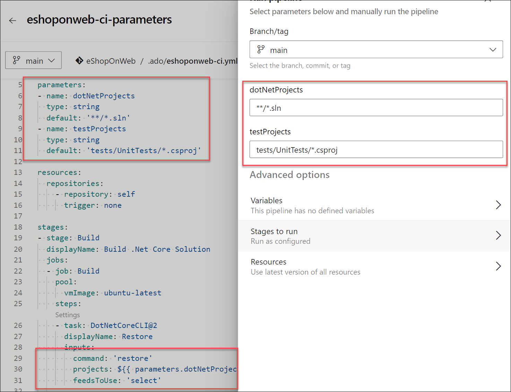
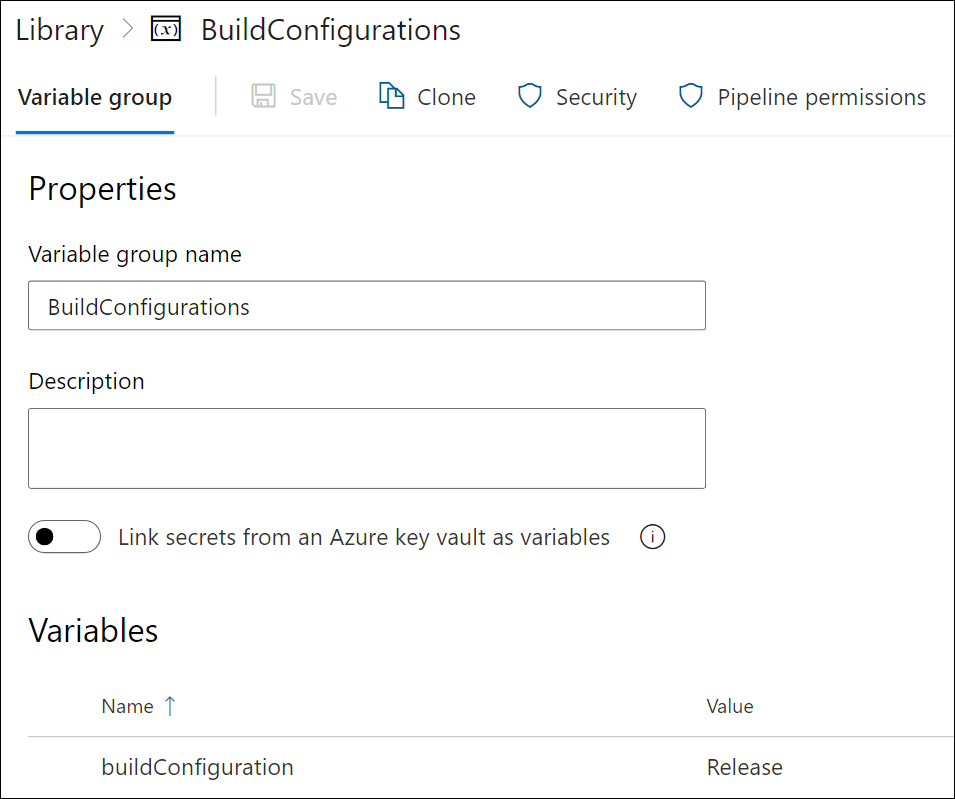
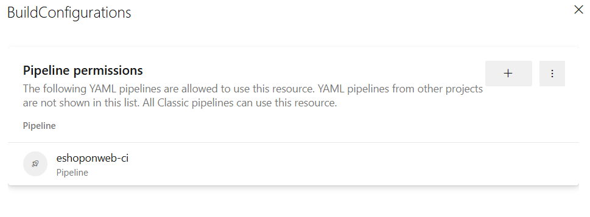
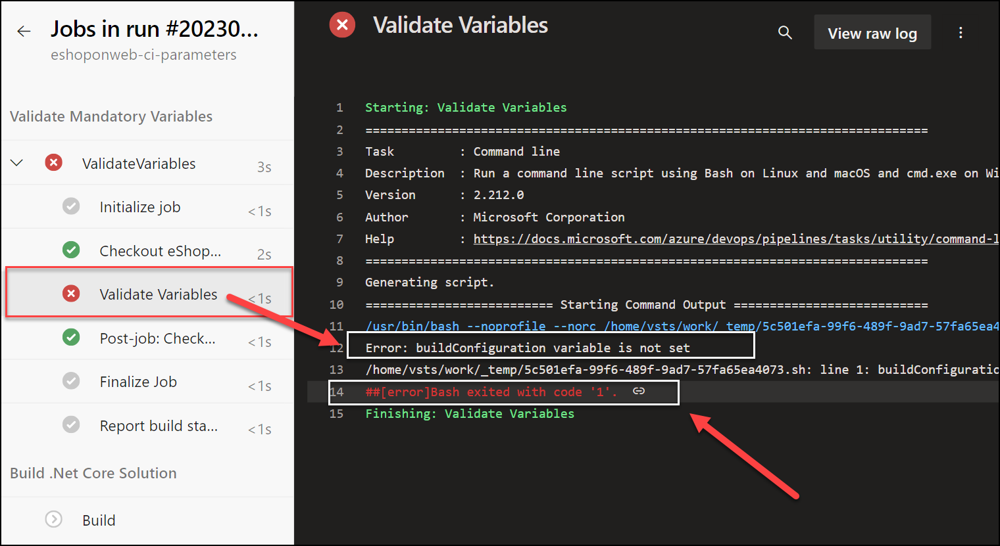

---
lab:
    title: 'Configure pipelines to securely use variables and parameters'
    module: 'Module 7: Configure pipelines to securely use variables and parameters'
---

# Configure pipelines to securely use variables and parameters

In this lab, you will learn how to configure pipelines to securely use variables and parameters.

These exercises take approximately **20** minutes.

## Before you start

You'll need an Azure subscription, Azure DevOps organization, and the eShopOnWeb application to follow the labs.

- Follow the steps to [validate your lab environment](APL2001_M00_Validate_Lab_Environment.md).

## Instructions

### Exercise 1: Ensure parameter and variable types

#### Task 1: (If done, skip) Import and run the CI pipeline

Start by importing the CI pipeline named [eshoponweb-ci.yml](https://github.com/MicrosoftLearning/eShopOnWeb/blob/main/.ado/eshoponweb-ci.yml).

1. Navigate to the Azure DevOps portal at `https://dev.azure.com` and open your organization.

1. Open the eShopOnWeb project.

1. Go to **Pipelines > Pipelines**.

1. Select **New Pipeline** button.

1. Select **Azure Repos Git (Yaml)**.

1. Select the **eShopOnWeb** repository.

1. Select **Existing Azure Pipelines YAML File**.

1. Select the **/.ado/eshoponweb-ci.yml** file then select **Continue**.

1. Select the **Run** button to run the pipeline.

1. Your pipeline will take a name based on the project name. Rename it for identifying the pipeline better.

1. Go to **Pipelines > Pipelines** and select the recently created pipeline. select the ellipsis and **Rename/Remove** option.

1. Name it **eshoponweb-ci-parameters** and select **Save**.

#### Task 2: Ensure parameter types for YAML pipelines

In this task, you will set parameter and parameter types for the pipeline.

1. Go to **Pipelines > Pipelines** and select the **eshoponweb-ci-parameters** pipeline.

1. Select **Edit**.

1. Add the following parameters to the top of the YAML file:

    ```YAML
    parameters:
   - name: dotNetProjects
     type: string
     default: '**/*.sln'
   - name: testProjects
     type: string
     default: 'tests/UnitTests/*.csproj'

    ```

1. Replace the hardcoded paths in the 'Restore', 'Build', and 'Test' tasks with the parameters you just created.
   - **Replace projects**: '**/*.sln' with projects: ${{ parameters.dotNetProjects }} in the 'Restore' and 'Build' tasks.
   - **Replace projects**: 'tests/UnitTests/*.csproj' with projects: ${{ parameters.testProjects }} in the 'Test' task.

    Your YAML file should look like this:

    ```YAML
        steps:
        - task: DotNetCoreCLI@2
          displayName: Restore
          inputs:
            command: 'restore'
            projects: ${{ parameters.dotNetProjects }}
            feedsToUse: 'select'
    
        - task: DotNetCoreCLI@2
          displayName: Build
          inputs:
            command: 'build'
            projects: ${{ parameters.dotNetProjects }}
    
        - task: DotNetCoreCLI@2
          displayName: Test
          inputs:
            command: 'test'
            projects: ${{ parameters.testProjects }}

    ```

1. Save the pipeline and run it, it should run successfully.

    

#### Task 2: Securing variables and parameters

In this task, you will secure the variables and parameters from your pipeline by using variable groups.

1. Go to **Pipelines > Library**.

1. Select the **+ Variable group** button to create a new variable group. Give it a name like **BuildConfigurations**.

1. Add a variable named **buildConfiguration** and set its value to `Release`.

1. Save the variable group.

    

1. Select the **Pipeline permissions** button and select the **+ Add** button to add a new pipeline.

1. Select the **eshoponweb-ci-parameters** pipeline and select **Add** to allow the pipeline to use the variable group.

    

1. (Optional) You can also set specific users or groups to be able to edit the variable group by clicking on the **Security** button.

1. Go back to the YAML file and at the top of the file, right under the parameters, reference the variable group by adding the following:

    ```YAML
    variables:
      - group: BuildConfigurations
    
    ```

1. In the 'Build' task, replace command: 'build' with the following lines to utilize the build configuration from the variable group.

    ```YAML
    command: 'build'
    projects: ${{ parameters.dotNetProjects }}
    configuration: $(buildConfiguration)
    
    ```

1. Save the pipeline and run it. It should run successfully with the build configuration set to `Release`. You can verify this by looking at the logs of the 'Build' task.

Following this approach, you can secure your variables and parameters by using variable groups without having to hardcode them in your YAML file.

#### Task 3: Validating mandatory variables and parameters

In this task, you will validate the mandatory variables before the pipeline executes.

1. Go to **Pipelines > Pipelines**.

1. Open **eshoponweb-ci-parameters** pipeline and select **Edit**.

1. Add a new stage as the first stage named **Validate** to validate the mandatory variables before the pipeline executes.

    ```YAML
    - stage: Validate
      displayName: Validate mandatory variables
      jobs:
      - job: ValidateVariables
        pool:
          vmImage: ubuntu-latest
        steps:
        - script: |
            if [ -z "$(buildConfiguration)" ]; then
              echo "Error: buildConfiguration variable is not set"
              exit 1
            fi
          displayName: 'Validate Variables'
    
    ```

    > [!NOTE]
    > This stage will run a script to validate the buildConfiguration variable. If the variable is not set, the script will fail and the pipeline will stop.

1. Make the **Build** stage depend on the **Validate** stage by adding dependsOn: Validate under the Build stage:

    ```YAML
    - stage: Build
      displayName: Build .Net Core Solution
      dependsOn: Validate
    
    ```

1. Save the pipeline and run it. It will run successfully because the buildConfiguration variable is set in the variable group.

1. To test the validation, remove the buildConfiguration variable from the variable group, or delete the variable group, and run the pipeline again. It should fail with the following error:

    You should see the following error in the logs:

    ```YAML
    Error: buildConfiguration variable is not set
    
    ```

    

1. Add the variable group and the buildConfiguration variable back to the variable group and run the pipeline again. It should run successfully.

## Review

In this lab you learned how to configure pipelines to securely use variables and parameters, and how to validate mandatory variables and parameters.
